# Polyglot Codebase Knowledge Graph

> Generated offline by **readmenator**. 23 files, 348 symbols, 3 imports. Supports C, C++, Python, Go, Rust, JS/TS, Java, C#, Shell, PHP, Dart, GDScript, Nim, ASM, Ruby, Swift, Kotlin, Scala, Lua, Elixir.
> No LLMs. No tokens. Pure static analysis. See more [here](https://github.com/grisuno/ReadMenator)

**Start here:** Statistics Dashboard for scope, God Nodes for blast radius, Architecture Reference for per-file API. Agents: prefer `readmenator-agent/INDEX.md` + `SYMBOLS.md`.

**Total Files Parsed:** 23 | **Total Symbols Extracted:** 348 | **Total Imports:** 3

<!-- ranking_model: v1.0 | weights: {ppr:0.45,auth:0.2,test:0.15,doc:0.1,fresh:0.1} | alpha:0.85 | commit:b3ca3bb | date:2026-07-18 -->


## Table of Contents

1. [Statistics Dashboard](#statistics-dashboard)
2. [Architectural Layers](#architectural-layers)
3. [Ranked Context](#ranked-context)
4. [God Nodes](#god-nodes)
5. [Suggested Questions](#suggested-questions)
6. [Hotspot Analysis](#hotspot-analysis)
7. [Change Impact Analysis](#change-impact-analysis)
8. [Suggested Linting Rules](#suggested-linting-rules)
9. [Orphans](#orphans)
10. [Query Recipes](#query-recipes)
11. [Structural Knowledge Map](#structural-knowledge-map)
12. [UML Class Diagram](#uml-class-diagram)
13. [Code Property Graph](#code-property-graph)
14. [Architecture Reference](#architecture-reference)
    - [C (9 files)](#c-9-files)
    - [PY (1 files)](#py-1-files)
    - [S (10 files)](#s-10-files)
    - [SH (3 files)](#sh-3-files)

---

## Statistics Dashboard

| Metric | Value |
|--------|-------|
| Total Files | 23 |
| Total Symbols | 348 |
| Total Imports | 3 |
| Call Edges | 0 |
| Inheritance Edges | 0 |
| Languages | 4 |
| Avg Symbols/File | 15.1 |
| Avg Imports/File | 0.1 |

### Top Files by Import Count (Fan-Out)

| File | Imports | Symbols | Language |
|------|---------|---------|----------|
| `ld.c` | 3 | 302 | c |

---

## Architectural Layers

Auto-detected from path patterns, naming conventions, and imported frameworks.

| Layer | Files |
|-------|-------|
| testing | 20 |
| utility | 3 |

### utility

- `app.py` (py, 0 symbols)
- `install.sh` (sh, 0 symbols)
- `ld.c` (c, 302 symbols)

### testing

- `argv.c` (c, 2 symbols)
- `argv.s` (s, 2 symbols)
- `asm.c` (c, 4 symbols)
- `chain.c` (c, 2 symbols)
- `fib.s` (s, 3 symbols)
- `fib2.s` (s, 3 symbols)
- `fib3.s` (s, 3 symbols)
- `fmt.c` (c, 2 symbols)
- `globals.c` (c, 3 symbols)
- `hello.c` (c, 1 symbols)
- `loop.s` (s, 2 symbols)
- `movslq.s` (s, 2 symbols)
- `mutate.sh` (sh, 0 symbols)
- `priv.s` (s, 2 symbols)
- `run_tests.sh` (sh, 6 symbols)
- *... and 5 more*

---

## Ranked Context

Files ranked by composite score for the current query context. The ranking combines Personalized PageRank (query relevance), global authority, test coverage, documentation coverage, and code freshness. Model: v1.0.

| Rank | File | Composite | PPR | Authority | Test | Doc |
|------|------|-----------|-----|-----------|------|-----|
| 1 | `app.py` | 0.1000 | 0.0000 | 0.0000 | 0.00 | 1.00 |
| 2 | `mutate.sh` | 0.1000 | 0.0000 | 0.0000 | 0.00 | 1.00 |
| 3 | `run_tests.sh` | 0.0833 | 0.0000 | 0.0000 | 0.00 | 0.83 |
| 4 | `ld.c` | 0.0023 | 0.0000 | 0.0000 | 0.00 | 0.02 |
| 5 | `install.sh` | 0.0000 | 0.0000 | 0.0000 | 0.00 | 0.00 |
| 6 | `argv.c` | 0.0000 | 0.0000 | 0.0000 | 0.00 | 0.00 |
| 7 | `argv.s` | 0.0000 | 0.0000 | 0.0000 | 0.00 | 0.00 |
| 8 | `asm.c` | 0.0000 | 0.0000 | 0.0000 | 0.00 | 0.00 |
| 9 | `chain.c` | 0.0000 | 0.0000 | 0.0000 | 0.00 | 0.00 |
| 10 | `fib.s` | 0.0000 | 0.0000 | 0.0000 | 0.00 | 0.00 |

---

## God Nodes

Most architecturally central files ranked by combined import/export degree and symbol richness.

| File | Score | Connections | PageRank |
|------|-------|-------------|----------|
| `ld.c` | 30.2 | | 0.0000 |
| `run_tests.sh` | 0.6 | | 0.0000 |
| `asm.c` | 0.4 | | 0.0000 |
| `fib.s` | 0.3 | | 0.0000 |
| `fib2.s` | 0.3 | | 0.0000 |
| `fib3.s` | 0.3 | | 0.0000 |
| `globals.c` | 0.3 | | 0.0000 |
| `argv.c` | 0.2 | | 0.0000 |
| `argv.s` | 0.2 | | 0.0000 |
| `chain.c` | 0.2 | | 0.0000 |

---

## Suggested Questions

Auto-generated exploration prompts based on graph structure:

- What does ld.c depend on, and what depends on it? (0 connections)
- What does run_tests.sh depend on, and what depends on it? (0 connections)
- What does asm.c depend on, and what depends on it? (0 connections)
- What is Sym in ld.c and how is it used?
- What is the overall architecture of this codebase?

---

## Hotspot Analysis

Files ranked by combined complexity (symbol count) and centrality (connection count). High-scoring files are architecturally critical and may need refactoring attention.

| File | Complexity | Centrality | Combined | Symbols | Connections |
|------|-----------|------------|----------|---------|-------------|
| `app.py` | 0.000 | 0.000 | 0.000 | 0 | 0 |
| `mutate.sh` | 0.000 | 0.000 | 0.000 | 0 | 0 |
| `run_tests.sh` | 0.020 | 0.000 | 0.008 | 6 | 0 |
| `ld.c` | 1.000 | 1.000 | 1.000 | 302 | 3 |
| `install.sh` | 0.000 | 0.000 | 0.000 | 0 | 0 |
| `argv.c` | 0.007 | 0.000 | 0.003 | 2 | 0 |
| `argv.s` | 0.007 | 0.000 | 0.003 | 2 | 0 |
| `asm.c` | 0.013 | 0.000 | 0.005 | 4 | 0 |
| `chain.c` | 0.007 | 0.000 | 0.003 | 2 | 0 |
| `fib.s` | 0.010 | 0.000 | 0.004 | 3 | 0 |
| `fib2.s` | 0.010 | 0.000 | 0.004 | 3 | 0 |
| `fib3.s` | 0.010 | 0.000 | 0.004 | 3 | 0 |
| `globals.c` | 0.010 | 0.000 | 0.004 | 3 | 0 |
| `fmt.c` | 0.007 | 0.000 | 0.003 | 2 | 0 |
| `loop.s` | 0.007 | 0.000 | 0.003 | 2 | 0 |

---

## Change Impact Analysis

Files sorted by how many other files would be affected if they changed. High-impact files should be changed with caution.

| File | Direct Dependents | Transitive Dependents | Total Impact |
|------|------------------|----------------------|--------------|
| `app.py` | 0 | 0 | 0 |
| `install.sh` | 0 | 0 | 0 |
| `ld.c` | 0 | 0 | 0 |
| `argv.c` | 0 | 0 | 0 |
| `argv.s` | 0 | 0 | 0 |
| `asm.c` | 0 | 0 | 0 |
| `chain.c` | 0 | 0 | 0 |
| `fib.s` | 0 | 0 | 0 |
| `fib2.s` | 0 | 0 | 0 |
| `fib3.s` | 0 | 0 | 0 |
| `fmt.c` | 0 | 0 | 0 |
| `globals.c` | 0 | 0 | 0 |
| `hello.c` | 0 | 0 | 0 |
| `loop.s` | 0 | 0 | 0 |
| `movslq.s` | 0 | 0 | 0 |

---

## Suggested Linting Rules

Automatically suggested linting and security rules based on patterns detected in the codebase. These can be exported as Semgrep rules using the `--export-rules` flag.

| Rule ID | Severity | Description | Language | Matches |
|---------|----------|-------------|----------|---------|
| `RM001` | info | Large number of functions in sh: 6 total | sh | 6 |
| `RM002` | info | Large number of functions in c: 150 total | c | 150 |
| `RM003` | info | Large number of functions in s: 23 total | s | 23 |

---

## Orphans

Files with no documentation or low connectivity. These are candidates for documentation investment or cleanup.

- `install.sh` (0 symbols, no doc)
- `argv.c` (2 symbols, no doc)
- `argv.s` (2 symbols, no doc)
- `asm.c` (4 symbols, no doc)
- `chain.c` (2 symbols, no doc)
- `fib.s` (3 symbols, no doc)
- `fib2.s` (3 symbols, no doc)
- `fib3.s` (3 symbols, no doc)
- `fmt.c` (2 symbols, no doc)
- `globals.c` (3 symbols, no doc)
- `hello.c` (1 symbols, no doc)
- `loop.s` (2 symbols, no doc)
- `movslq.s` (2 symbols, no doc)
- `priv.s` (2 symbols, no doc)
- `start.s` (2 symbols, no doc)
- `t1.c` (1 symbols, no doc)
- `t1.s` (2 symbols, no doc)
- `w1.c` (2 symbols, no doc)
- `w1.s` (2 symbols, no doc)

---

## Query Recipes

Example queries you can run against this knowledge base using the ranking engine:

```
# Find files most relevant to a concept
readmenator query "Where is the import resolver implemented?"

# Rank files by relevance to a topic
readmenator query "How does documentation generation work?"

# Explain why a file ranks highly
readmenator query "explain readmenator/_documentation.py"

# Trace dependency paths with ranked context
readmenator query "path from CLI to exporter"
```

The ranking model uses the following signals:

- **Personalized PageRank** (45% weight): query-specific relevance via seed propagation
- **Global Authority** (20% weight): structural importance via standard PageRank
- **Test Coverage** (15% weight): fraction of symbols referenced in test files
- **Doc Coverage** (10% weight): presence of docstrings and file-level docs
- **Freshness** (10% weight): recent modification activity

Results include score decomposition and justification paths for each ranked item.

---

## Structural Knowledge Map

```mermaid
graph TD
    classDef mod fill:#1e1e1e,stroke:#ff6666,stroke-width:2px,color:#fff;
    classDef cls fill:#2d2d2d,stroke:#4ec9b0,stroke-width:2px,color:#fff;
    classDef fn fill:#333,stroke:#dcdcaa,stroke-width:1px,color:#dcdcaa;
    classDef ext fill:#111,stroke:#666,stroke-dasharray:5 5,color:#aaa;
    ld_c["ld.c (c)"]
    class ld_c mod;
    ld_c_Sym["Sym"]
    class ld_c_Sym cls;
    ld_c --> ld_c_Sym
    ld_c_Op["Op"]
    class ld_c_Op cls;
    ld_c --> ld_c_Op
    ld_c_Fixup["Fixup"]
    class ld_c_Fixup cls;
    ld_c --> ld_c_Fixup
    ld_c_LineSrc["LineSrc"]
    class ld_c_LineSrc cls;
    ld_c --> ld_c_LineSrc
    ld_c_Func["Func"]
    class ld_c_Func cls;
    ld_c --> ld_c_Func
    test_run_tests_sh["run_tests.sh (sh)"]
    class test_run_tests_sh mod;
    test_asm_c["asm.c (c)"]
    class test_asm_c mod;
    test_fib_s["fib.s (s)"]
    class test_fib_s mod;
    test_fib2_s["fib2.s (s)"]
    class test_fib2_s mod;
    test_fib3_s["fib3.s (s)"]
    class test_fib3_s mod;
    test_globals_c["globals.c (c)"]
    class test_globals_c mod;
    test_argv_c["argv.c (c)"]
    class test_argv_c mod;
    test_argv_s["argv.s (s)"]
    class test_argv_s mod;
    test_chain_c["chain.c (c)"]
    class test_chain_c mod;
    test_fmt_c["fmt.c (c)"]
    class test_fmt_c mod;
    test_loop_s["loop.s (s)"]
    class test_loop_s mod;
    test_movslq_s["movslq.s (s)"]
    class test_movslq_s mod;
    test_priv_s["priv.s (s)"]
    class test_priv_s mod;
    test_start_s["start.s (s)"]
    class test_start_s mod;
    test_t1_s["t1.s (s)"]
    class test_t1_s mod;
    test_w1_c["w1.c (c)"]
    class test_w1_c mod;
    test_w1_s["w1.s (s)"]
    class test_w1_s mod;
    test_hello_c["hello.c (c)"]
    class test_hello_c mod;
    test_t1_c["t1.c (c)"]
    class test_t1_c mod;
    app_py["app.py (py)"]
    class app_py mod;
    install_sh["install.sh (sh)"]
    class install_sh mod;
    test_mutate_sh["mutate.sh (sh)"]
    class test_mutate_sh mod;
    ext_stdio_h["stdio.h"]
    class ext_stdio_h ext;
    ld_c -.->|imports| ext_stdio_h
    ext_stdlib_h["stdlib.h"]
    class ext_stdlib_h ext;
    ld_c -.->|imports| ext_stdlib_h
    ext_string_h["string.h"]
    class ext_string_h ext;
    ld_c -.->|imports| ext_string_h
```



---

## UML Class Diagram

Auto-generated Mermaid class diagram from parsed class-level symbols. Shows classes, structs, interfaces, traits, and their methods with inheritance and dependency relationships.

```mermaid
classDiagram
  class ld_c_Sym {
    <<struct>>
    +die(const char *msg)
    +breserve(unsigned char **p, long *cap, long need)
    +fixup_reserve(void)
    +creserve(char **p, long *cap, long need)
    +parse_num(const char *s)
    +trim(char *s)
    +strip_comment(char *s)
    +name_copy(char *dst, const char *src)
    +split_word(char *line, char *word, long wcap, char **rest)
    +hexval(char c)
  }
  class ld_c_Op {
    <<struct>>
    +die(const char *msg)
    +breserve(unsigned char **p, long *cap, long need)
    +fixup_reserve(void)
    +creserve(char **p, long *cap, long need)
    +parse_num(const char *s)
    +trim(char *s)
    +strip_comment(char *s)
    +name_copy(char *dst, const char *src)
    +split_word(char *line, char *word, long wcap, char **rest)
    +hexval(char c)
  }
  class ld_c_Fixup {
    <<struct>>
    +die(const char *msg)
    +breserve(unsigned char **p, long *cap, long need)
    +fixup_reserve(void)
    +creserve(char **p, long *cap, long need)
    +parse_num(const char *s)
    +trim(char *s)
    +strip_comment(char *s)
    +name_copy(char *dst, const char *src)
    +split_word(char *line, char *word, long wcap, char **rest)
    +hexval(char c)
  }
  class ld_c_LineSrc {
    <<struct>>
    +die(const char *msg)
    +breserve(unsigned char **p, long *cap, long need)
    +fixup_reserve(void)
    +creserve(char **p, long *cap, long need)
    +parse_num(const char *s)
    +trim(char *s)
    +strip_comment(char *s)
    +name_copy(char *dst, const char *src)
    +split_word(char *line, char *word, long wcap, char **rest)
    +hexval(char c)
  }
  class ld_c_Func {
    <<struct>>
    +die(const char *msg)
    +breserve(unsigned char **p, long *cap, long need)
    +fixup_reserve(void)
    +creserve(char **p, long *cap, long need)
    +parse_num(const char *s)
    +trim(char *s)
    +strip_comment(char *s)
    +name_copy(char *dst, const char *src)
    +split_word(char *line, char *word, long wcap, char **rest)
    +hexval(char c)
  }
  class ld_c_GVar {
    <<struct>>
    +die(const char *msg)
    +breserve(unsigned char **p, long *cap, long need)
    +fixup_reserve(void)
    +creserve(char **p, long *cap, long need)
    +parse_num(const char *s)
    +trim(char *s)
    +strip_comment(char *s)
    +name_copy(char *dst, const char *src)
    +split_word(char *line, char *word, long wcap, char **rest)
    +hexval(char c)
  }
  class ld_c_Blob {
    <<struct>>
    +die(const char *msg)
    +breserve(unsigned char **p, long *cap, long need)
    +fixup_reserve(void)
    +creserve(char **p, long *cap, long need)
    +parse_num(const char *s)
    +trim(char *s)
    +strip_comment(char *s)
    +name_copy(char *dst, const char *src)
    +split_word(char *line, char *word, long wcap, char **rest)
    +hexval(char c)
  }
  class ld_c_Nat {
    <<struct>>
    +die(const char *msg)
    +breserve(unsigned char **p, long *cap, long need)
    +fixup_reserve(void)
    +creserve(char **p, long *cap, long need)
    +parse_num(const char *s)
    +trim(char *s)
    +strip_comment(char *s)
    +name_copy(char *dst, const char *src)
    +split_word(char *line, char *word, long wcap, char **rest)
    +hexval(char c)
  }
  class ld_c_Label {
    <<struct>>
    +die(const char *msg)
    +breserve(unsigned char **p, long *cap, long need)
    +fixup_reserve(void)
    +creserve(char **p, long *cap, long need)
    +parse_num(const char *s)
    +trim(char *s)
    +strip_comment(char *s)
    +name_copy(char *dst, const char *src)
    +split_word(char *line, char *word, long wcap, char **rest)
    +hexval(char c)
  }
```



---

## Code Property Graph

Machine-readable Code Property Graph (CPG) in JSON-LD format. This block allows AI agents to parse the full structural graph without additional file reads. Compatible with GraphRAG pipelines.

```json
{"@context": "https://schema.org", "analysis": {"communities": [], "god_nodes": [{"node_id": "ld.c", "score": 30.2}, {"node_id": "test/run_tests.sh", "score": 0.6}, {"node_id": "test/asm.c", "score": 0.4}, {"node_id": "test/fib.s", "score": 0.3}, {"node_id": "test/fib2.s", "score": 0.3}, {"node_id": "test/fib3.s", "score": 0.3}, {"node_id": "test/globals.c", "score": 0.3}, {"node_id": "test/argv.c", "score": 0.2}, {"node_id": "test/argv.s", "score": 0.2}, {"node_id": "test/chain.c", "score": 0.2}], "surprising_connections": []}, "edges": [{"confidence": "EXTRACTED", "relation": "imports", "source": "ld.c", "target": "stdio.h"}, {"confidence": "EXTRACTED", "relation": "imports", "source": "ld.c", "target": "stdlib.h"}, {"confidence": "EXTRACTED", "relation": "imports", "source": "ld.c", "target": "string.h"}], "generator": "readmenator", "metadata": {"edge_count": 3, "file_count": 23, "language_count": 4, "symbol_count": 348}, "nodes": [{"doc": "_*_ coding: utf8 _*_", "id": "app.py", "kind": "module", "label": "app.py", "language": "py", "sha256": "57b21bdb023585b8", "symbol_count": 0, "symbols": []}, {"id": "install.sh", "kind": "module", "label": "install.sh", "language": "sh", "sha256": "c907d80fd6734993", "symbol_count": 0, "symbols": []}, {"id": "ld.c", "kind": "module", "label": "ld.c", "language": "c", "sha256": "7c40c11f136575c9", "symbol_count": 302, "symbols": [{"kind": "struct", "line": 209, "name": "Sym"}, {"kind": "struct", "line": 221, "name": "Op"}, {"kind": "struct", "line": 236, "name": "Fixup"}, {"kind": "struct", "line": 242, "name": "LineSrc"}, {"kind": "struct", "line": 250, "name": "Func"}, {"kind": "struct", "line": 257, "name": "GVar"}, {"kind": "struct", "line": 264, "name": "Blob"}, {"kind": "struct", "line": 271, "name": "Nat"}, {"kind": "struct", "line": 275, "name": "Label"}, {"doc": "================================================================ Diagnostics and memory * ================================================================", "kind": "function", "line": 340, "name": "die", "signature": "static void die(const char *msg)"}, {"kind": "function", "line": 349, "name": "breserve", "signature": "static void breserve(unsigned char **p, long *cap, long need)"}, {"doc": "Grow the fixup table so that one more entry fits. The table is heap allocated rather than statically reserved: a worst-case static array would * dominate the image and put it out of reach of hosts with a small heap.", "kind": "function", "line": 369, "name": "fixup_reserve", "signature": "static void fixup_reserve(void)"}, {"kind": "function", "line": 384, "name": "creserve", "signature": "static void creserve(char **p, long *cap, long need)"}, {"kind": "function", "line": 400, "name": "parse_num", "signature": "static long parse_num(const char *s)"}, {"kind": "function", "line": 432, "name": "trim", "signature": "static char *trim(char *s)"}, {"doc": "Truncate at the first '#' outside a double-quoted string: '#' is the * comment character, but a string literal may carry one (\"#\").", "kind": "function", "line": 443, "name": "strip_comment", "signature": "static void strip_comment(char *s)"}, {"kind": "function", "line": 457, "name": "name_copy", "signature": "static void name_copy(char *dst, const char *src)"}, {"kind": "function", "line": 464, "name": "split_word", "signature": "static void split_word(char *line, char *word, long wcap, char **rest)"}, {"kind": "function", "line": 477, "name": "hexval", "signature": "static int hexval(char c)"}, {"kind": "function", "line": 484, "name": "find_sym", "signature": "static int find_sym(const char *name)"}, {"kind": "function", "line": 490, "name": "add_sym", "signature": "static int add_sym(const char *name, int kind, int sec)"}, {"kind": "function", "line": 526, "name": "parse_reg", "signature": "static int parse_reg(const char *s, int *reg, int *sz)"}, {"kind": "function", "line": 538, "name": "parse_mem", "signature": "static void parse_mem(char *s, Op *op)"}, {"kind": "function", "line": 591, "name": "parse_operand", "signature": "static void parse_operand(char *s, Op *op)"}, {"kind": "function", "line": 622, "name": "split_operands", "signature": "static int split_operands(char *rest, char *o1, char *o2)"}, {"kind": "function", "line": 647, "name": "ls_open_file", "signature": "static void ls_open_file(LineSrc *s, const char *path)"}, {"kind": "function", "line": 659, "name": "ls_open_mem", "signature": "static void ls_open_mem(LineSrc *s, const char *text)"}, {"kind": "function", "line": 667, "name": "ls_getline", "signature": "static int ls_getline(LineSrc *s, char *buf, size_t n)"}, {"kind": "function", "line": 683, "name": "ls_close", "signature": "static void ls_close(LineSrc *s)"}, {"doc": "================================================================ Data region helpers * ================================================================", "kind": "function", "line": 691, "name": "data_put", "signature": "static void data_put(unsigned char b)"}, {"kind": "function", "line": 696, "name": "data_fill", "signature": "static void data_fill(long n, unsigned char b)"}, {"kind": "function", "line": 703, "name": "data_align", "signature": "static void data_align(long a)"}, {"kind": "function", "line": 707, "name": "blob_put", "signature": "static void blob_put(unsigned char b)"}, {"kind": "function", "line": 712, "name": "blob_append_str", "signature": "static void blob_append_str(char *s)"}, {"kind": "function", "line": 751, "name": "set_section", "signature": "static int set_section(char *line)"}, {"doc": "================================================================ Shared scan pass * ================================================================", "kind": "function", "line": 774, "name": "scan_directive", "signature": "static void scan_directive(char *line, int *section, int pending_global,\n                        ..."}, {"kind": "function", "line": 870, "name": "scan_src", "signature": "static void scan_src(LineSrc *src, int from_stubs)"}, {"doc": "================================================================ CVM backend * ================================================================", "kind": "function", "line": 941, "name": "cvm_find_func", "signature": "static int cvm_find_func(const char *name)"}, {"kind": "function", "line": 947, "name": "cvm_find_global", "signature": "static int cvm_find_global(const char *name)"}, {"kind": "function", "line": 953, "name": "cvm_find_blob", "signature": "static int cvm_find_blob(const char *name)"}, {"kind": "function", "line": 959, "name": "cvm_find_nat", "signature": "static int cvm_find_nat(const char *name)"}, {"kind": "function", "line": 965, "name": "cvm_add_nat", "signature": "static int cvm_add_nat(const char *name)"}, {"kind": "function", "line": 974, "name": "e1", "signature": "static void e1(int b)"}, {"kind": "function", "line": 979, "name": "e4", "signature": "static void e4(long v)"}, {"kind": "function", "line": 987, "name": "e8", "signature": "static void e8(unsigned long long v)"}, {"kind": "function", "line": 995, "name": "eimm", "signature": "static void eimm(long long v)"}, {"kind": "function", "line": 1008, "name": "epush_local", "signature": "static void epush_local(int slot)"}, {"kind": "function", "line": 1010, "name": "estore_local", "signature": "static void estore_local(int slot)"}, {"kind": "function", "line": 1011, "name": "epush_global", "signature": "static void epush_global(int slot)"}, {"kind": "function", "line": 1012, "name": "estore_global", "signature": "static void estore_global(int slot)"}, {"kind": "function", "line": 1013, "name": "cvm_slot", "signature": "static int cvm_slot(int std)"}, {"kind": "function", "line": 1020, "name": "epush_reg", "signature": "static void epush_reg(int r)"}, {"kind": "function", "line": 1026, "name": "estore_reg", "signature": "static void estore_reg(int r)"}, {"kind": "function", "line": 1032, "name": "pool_add", "signature": "static long pool_add(const char *s)"}, {"kind": "function", "line": 1041, "name": "cvm_fixup_add", "signature": "static void cvm_fixup_add(long pos, const char *name)"}, {"kind": "function", "line": 1048, "name": "ejmp", "signature": "static void ejmp(const char *lbl)"}, {"kind": "function", "line": 1050, "name": "ejz", "signature": "static void ejz(const char *lbl)"}, {"kind": "function", "line": 1051, "name": "ejnz", "signature": "static void ejnz(const char *lbl)"}, {"kind": "function", "line": 1052, "name": "find_label", "signature": "static long find_label(const char *name)"}, {"kind": "function", "line": 1058, "name": "add_label", "signature": "static void add_label(const char *name, long off)"}, {"kind": "function", "line": 1066, "name": "resolve_fixups", "signature": "static void resolve_fixups(void)"}, {"kind": "function", "line": 1085, "name": "push_mask32", "signature": "static void push_mask32(void)"}, {"kind": "function", "line": 1087, "name": "push_mask8", "signature": "static void push_mask8(void)"}, {"kind": "function", "line": 1088, "name": "push_mask16", "signature": "static void push_mask16(void)"}, {"kind": "function", "line": 1089, "name": "elea_mem", "signature": "static void elea_mem(Op *op)"}, {"kind": "function", "line": 1104, "name": "elea_operand", "signature": "static void elea_operand(Op *op)"}, {"kind": "function", "line": 1138, "name": "epush_value", "signature": "static void epush_value(Op *op, int size)"}, {"kind": "function", "line": 1164, "name": "signext8", "signature": "static void signext8(void)"}, {"kind": "function", "line": 1170, "name": "signext32", "signature": "static void signext32(void)"}, {"kind": "function", "line": 1176, "name": "signext16", "signature": "static void signext16(void)"}, {"kind": "function", "line": 1182, "name": "mov", "signature": "static void mov(int size, Op *s, Op *d)"}, {"kind": "function", "line": 1242, "name": "arith_mem", "signature": "static void arith_mem(int opc, int size, Op *d, Op *s)"}, {"kind": "function", "line": 1259, "name": "arith_reg", "signature": "static void arith_reg(int opc, int size, Op *d, Op *s)"}, {"kind": "function", "line": 1287, "name": "cvm_push_cmpval", "signature": "static void cvm_push_cmpval(Op *o, int size)"}, {"kind": "function", "line": 1293, "name": "cvm_cmp", "signature": "static void cvm_cmp(int size, Op *o1, Op *o2)"}, {"kind": "function", "line": 1300, "name": "cvm_translate", "signature": "static void cvm_translate(const char *mn, Op *o1, Op *o2)"}, {"kind": "function", "line": 1866, "name": "cvm_prepare_tables", "signature": "static void cvm_prepare_tables(void)"}, {"kind": "function", "line": 1898, "name": "cvm_layout_data", "signature": "static void cvm_layout_data(void)"}, {"kind": "function", "line": 1943, "name": "func_glue", "signature": "static void func_glue(void)"}, {"kind": "function", "line": 1952, "name": "entry_glue", "signature": "static void entry_glue(void)"}, {"kind": "function", "line": 1966, "name": "cvm_encode", "signature": "static void cvm_encode(LineSrc *src)"}, {"kind": "function", "line": 2040, "name": "w32", "signature": "static void w32(unsigned char *p, long v)"}, {"kind": "function", "line": 2047, "name": "w16", "signature": "static void w16(unsigned char *p, long v)"}, {"kind": "function", "line": 2052, "name": "w64_at", "signature": "static void w64_at(unsigned char *p, unsigned long long v)"}, {"kind": "function", "line": 2059, "name": "cvm_write_module", "signature": "static void cvm_write_module(const char *path)"}, {"kind": "function", "line": 2897, "name": "x86_align_up", "signature": "static long x86_align_up(long v, long a)"}, {"kind": "function", "line": 2901, "name": "x8", "signature": "static void x8(int b)"}, {"kind": "function", "line": 2906, "name": "x16", "signature": "static void x16(long v)"}, {"kind": "function", "line": 2912, "name": "x32", "signature": "static void x32(long v)"}, {"kind": "function", "line": 2920, "name": "x64", "signature": "static void x64(unsigned long long v)"}, {"kind": "function", "line": 2928, "name": "xfix32", "signature": "static void xfix32(const char *sym)"}, {"kind": "function", "line": 2937, "name": "fixup_trail", "signature": "static void fixup_trail(long t)"}, {"kind": "function", "line": 2942, "name": "emit_rex", "signature": "static void emit_rex(int w, int r, int x, int b)"}, {"kind": "function", "line": 2947, "name": "emit_modrm", "signature": "static void emit_modrm(int mod, int reg, int rm)"}, {"kind": "function", "line": 2951, "name": "emit_sib", "signature": "static void emit_sib(int scale, int index, int base)"}, {"kind": "function", "line": 2955, "name": "x86_ea_rex", "signature": "static void x86_ea_rex(const Op *op, int regfield, int rexw, int force)"}, {"kind": "function", "line": 2963, "name": "x86_ea_modrm", "signature": "static void x86_ea_modrm(const Op *op, int regfield)"}, {"kind": "function", "line": 3016, "name": "x86_rex_reg", "signature": "static void x86_rex_reg(int w, int regfield, int rm)"}, {"kind": "function", "line": 3020, "name": "x86_rex8", "signature": "static void x86_rex8(int regfield, int rm)"}, {"kind": "function", "line": 3027, "name": "ea_mov", "signature": "static void ea_mov(int size, const Op *o, int regfield)"}, {"kind": "function", "line": 3033, "name": "ea_mov_to", "signature": "static void ea_mov_to(int size, const Op *o, int regfield)"}, {"kind": "function", "line": 3039, "name": "ea_alu", "signature": "static void ea_alu(int g1, int size, const Op *o, int regfield, int from_mem)"}, {"kind": "function", "line": 3045, "name": "ea_cmp", "signature": "static void ea_cmp(int size, const Op *o, int regfield, int from_mem)"}, {"kind": "function", "line": 3051, "name": "ea_grp", "signature": "static void ea_grp(int opc, int size, const Op *o, int regfield)"}, {"kind": "function", "line": 3057, "name": "elf_mov", "signature": "static void elf_mov(int size, const Op *s, const Op *d)"}, {"kind": "function", "line": 3118, "name": "elf_movzx", "signature": "static void elf_movzx(const Op *s, const Op *d, int opc, int rexw, int has_0f)"}, {"kind": "function", "line": 3135, "name": "elf_movw", "signature": "static void elf_movw(const Op *s, const Op *d)"}, {"kind": "function", "line": 3170, "name": "elf_lea", "signature": "static void elf_lea(const Op *s, const Op *d)"}, {"kind": "function", "line": 3177, "name": "elf_push", "signature": "static void elf_push(const Op *o)"}, {"kind": "function", "line": 3201, "name": "elf_pop", "signature": "static void elf_pop(const Op *o)"}, {"kind": "function", "line": 3214, "name": "elf_alu", "signature": "static void elf_alu(int g1, int size, const Op *s, const Op *d)"}, {"kind": "function", "line": 3277, "name": "elf_imul", "signature": "static void elf_imul(const Op *s, const Op *d)"}, {"kind": "function", "line": 3306, "name": "elf_imull", "signature": "static void elf_imull(const Op *s, const Op *d)"}, {"kind": "function", "line": 3335, "name": "elf_grp3", "signature": "static void elf_grp3(const Op *o, int ext)"}, {"kind": "function", "line": 3349, "name": "elf_grp_ff", "signature": "static void elf_grp_ff(const Op *o, int ext)"}, {"kind": "function", "line": 3363, "name": "elf_shift_cl", "signature": "static void elf_shift_cl(const Op *s, const Op *d, int ext)"}, {"kind": "function", "line": 3371, "name": "elf_shift_cl32", "signature": "static void elf_shift_cl32(const Op *s, const Op *d, int ext)"}, {"kind": "function", "line": 3379, "name": "elf_testl", "signature": "static void elf_testl(const Op *s, const Op *d)"}, {"kind": "function", "line": 3396, "name": "elf_test", "signature": "static void elf_test(const Op *s, const Op *d)"}, {"kind": "function", "line": 3413, "name": "elf_cmp", "signature": "static void elf_cmp(int size, const Op *s, const Op *d)"}, {"kind": "function", "line": 3481, "name": "elf_set", "signature": "static void elf_set(int cc, const Op *o)"}, {"kind": "function", "line": 3489, "name": "elf_branch", "signature": "static void elf_branch(int opc, const Op *o)"}, {"kind": "function", "line": 3500, "name": "elf_ins", "signature": "static void elf_ins(const char *mn, const Op *o1, const Op *o2)"}, {"kind": "function", "line": 3586, "name": "elf_sym_addr", "signature": "static long elf_sym_addr(const Sym *s)"}, {"kind": "function", "line": 3599, "name": "elf_resolve_fixups", "signature": "static void elf_resolve_fixups(void)"}, {"kind": "function", "line": 3618, "name": "elf_encode_src", "signature": "static void elf_encode_src(LineSrc *src)"}, {"kind": "function", "line": 3674, "name": "elf_layout", "signature": "static void elf_layout(void)"}, {"kind": "function", "line": 3706, "name": "elf_write", "signature": "static void elf_write(const char *path)"}, {"kind": "function", "line": 3824, "name": "elf_build", "signature": "static void elf_build(const char *in_path, const char *out_path)"}, {"doc": "================================================================ CLI * ================================================================", "kind": "function", "line": 3900, "name": "usage", "signature": "static void usage(void)"}, {"kind": "function", "line": 3911, "name": "main", "signature": "int main(int argc, char **argv)"}, {"kind": "function", "line": 342, "name": "fprintf", "signature": "fprintf(stderr, \"ld: %s:%ld: %s\\n\", cur_file, cur_line, msg);"}, {"kind": "function", "line": 346, "name": "exit", "signature": "exit(1);"}, {"kind": "function", "line": 461, "name": "memcpy", "signature": "memcpy(dst, src, (size_t)n);"}, {"kind": "function", "line": 496, "name": "memset", "signature": "memset(&syms[i], 0, sizeof(syms[i]));"}, {"kind": "function", "line": 637, "name": "strncpy", "signature": "strncpy(o1, trim(rest), CFG_LINE_MAX - 1);"}, {"kind": "function", "line": 1835, "name": "sprintf", "signature": "sprintf(l1, \"..S%lda\", synth_n);"}, {"kind": "function", "line": 2096, "name": "fwrite", "signature": "fwrite(hdr, 1, CFG_CVM_HDR_SIZE, f);"}, {"kind": "function", "line": 2127, "name": "fputc", "signature": "fputc((int)(z - 1), f);"}, {"kind": "function", "line": 2139, "name": "fclose", "signature": "fclose(f);"}, {"kind": "function", "line": 2140, "name": "free", "signature": "free(func_name_off);"}, {"kind": "function", "line": 3947, "name": "strncat", "signature": "strncat(out, ext, CFG_NAME_MAX - strlen(out) - 1);"}, {"kind": "macro", "line": 24, "name": "CFG_MAX_SYMBOLS", "signature": "#define CFG_MAX_SYMBOLS"}, {"kind": "macro", "line": 26, "name": "CFG_MAX_FIXUPS", "signature": "#define CFG_MAX_FIXUPS"}, {"kind": "macro", "line": 27, "name": "CFG_FIXUP_INIT", "signature": "#define CFG_FIXUP_INIT"}, {"kind": "macro", "line": 28, "name": "CFG_LINE_MAX", "signature": "#define CFG_LINE_MAX"}, {"kind": "macro", "line": 29, "name": "CFG_NAME_MAX", "signature": "#define CFG_NAME_MAX"}, {"kind": "macro", "line": 30, "name": "CFG_MAX_NATS", "signature": "#define CFG_MAX_NATS"}, {"kind": "macro", "line": 31, "name": "CFG_MAX_ERRORS", "signature": "#define CFG_MAX_ERRORS"}, {"kind": "macro", "line": 32, "name": "CFG_GROW_UNIT", "signature": "#define CFG_GROW_UNIT"}, {"kind": "macro", "line": 33, "name": "CFG_ABI_BYTES", "signature": "#define CFG_ABI_BYTES"}, {"kind": "macro", "line": 35, "name": "CFG_STACK_BASE", "signature": "#define CFG_STACK_BASE"}, {"kind": "macro", "line": 36, "name": "CFG_XSTACK_DEF", "signature": "#define CFG_XSTACK_DEF"}, {"kind": "macro", "line": 40, "name": "CFG_MAX_ARGS", "signature": "#define CFG_MAX_ARGS"}, {"kind": "macro", "line": 41, "name": "CFG_REG_LOCALS", "signature": "#define CFG_REG_LOCALS"}, {"kind": "macro", "line": 43, "name": "CFG_SLOT_FLAGS_A", "signature": "#define CFG_SLOT_FLAGS_A"}, {"kind": "macro", "line": 44, "name": "CFG_SLOT_FLAGS_B", "signature": "#define CFG_SLOT_FLAGS_B"}, {"kind": "macro", "line": 45, "name": "CFG_SLOT_S0", "signature": "#define CFG_SLOT_S0"}, {"kind": "macro", "line": 46, "name": "CFG_SLOT_S1", "signature": "#define CFG_SLOT_S1"}, {"kind": "macro", "line": 47, "name": "CFG_GSLOT_RSP", "signature": "#define CFG_GSLOT_RSP"}, {"kind": "macro", "line": 49, "name": "CFG_GSLOT_RBP", "signature": "#define CFG_GSLOT_RBP"}, {"kind": "macro", "line": 50, "name": "CFG_GSLOT_ARGS", "signature": "#define CFG_GSLOT_ARGS"}, {"kind": "macro", "line": 51, "name": "CFG_GSLOT_RET", "signature": "#define CFG_GSLOT_RET"}, {"kind": "macro", "line": 52, "name": "CFG_CVM_MAGIC_0", "signature": "#define CFG_CVM_MAGIC_0"}, {"kind": "macro", "line": 54, "name": "CFG_CVM_MAGIC_1", "signature": "#define CFG_CVM_MAGIC_1"}, {"kind": "macro", "line": 55, "name": "CFG_CVM_MAGIC_2", "signature": "#define CFG_CVM_MAGIC_2"}, {"kind": "macro", "line": 56, "name": "CFG_CVM_MAGIC_3", "signature": "#define CFG_CVM_MAGIC_3"}, {"kind": "macro", "line": 57, "name": "CFG_CVM_VER_MAJ", "signature": "#define CFG_CVM_VER_MAJ"}, {"kind": "macro", "line": 58, "name": "CFG_CVM_VER_MIN", "signature": "#define CFG_CVM_VER_MIN"}, {"kind": "macro", "line": 59, "name": "CFG_CVM_HDR_SIZE", "signature": "#define CFG_CVM_HDR_SIZE"}, {"kind": "macro", "line": 60, "name": "CFG_ELF_PAGE", "signature": "#define CFG_ELF_PAGE"}, {"kind": "macro", "line": 62, "name": "CFG_ELF_HSIZE", "signature": "#define CFG_ELF_HSIZE"}, {"kind": "macro", "line": 63, "name": "CFG_ELF_PHENTSZ", "signature": "#define CFG_ELF_PHENTSZ"}, {"kind": "macro", "line": 64, "name": "CFG_ELF_PHNUM", "signature": "#define CFG_ELF_PHNUM"}, {"kind": "macro", "line": 65, "name": "CFG_ELF_SHENTSZ", "signature": "#define CFG_ELF_SHENTSZ"}, {"kind": "macro", "line": 66, "name": "CFG_ELF_SHNUM", "signature": "#define CFG_ELF_SHNUM"}, {"kind": "macro", "line": 67, "name": "CFG_ELF_SHSTRNDX", "signature": "#define CFG_ELF_SHSTRNDX"}, {"kind": "macro", "line": 68, "name": "CFG_ELF_ET_DYN", "signature": "#define CFG_ELF_ET_DYN"}, {"kind": "macro", "line": 69, "name": "CFG_ELF_EM_X8664", "signature": "#define CFG_ELF_EM_X8664"}, {"kind": "macro", "line": 70, "name": "CFG_ELF_PF_R", "signature": "#define CFG_ELF_PF_R"}, {"kind": "macro", "line": 71, "name": "CFG_ELF_PF_W", "signature": "#define CFG_ELF_PF_W"}, {"kind": "macro", "line": 72, "name": "CFG_ELF_PF_X", "signature": "#define CFG_ELF_PF_X"}, {"kind": "macro", "line": 73, "name": "CFG_ELF_PT_LOAD", "signature": "#define CFG_ELF_PT_LOAD"}, {"kind": "macro", "line": 74, "name": "CFG_ELF_SHT_PROGBITS", "signature": "#define CFG_ELF_SHT_PROGBITS"}, {"kind": "macro", "line": 75, "name": "CFG_ELF_SHT_NOBITS", "signature": "#define CFG_ELF_SHT_NOBITS"}, {"kind": "macro", "line": 76, "name": "CFG_ELF_SHT_STRTAB", "signature": "#define CFG_ELF_SHT_STRTAB"}, {"kind": "macro", "line": 77, "name": "CFG_ELF_SHF_A", "signature": "#define CFG_ELF_SHF_A"}, {"kind": "macro", "line": 78, "name": "CFG_ELF_SHF_X", "signature": "#define CFG_ELF_SHF_X"}, {"kind": "macro", "line": 79, "name": "CFG_ELF_SHF_W", "signature": "#define CFG_ELF_SHF_W"}, {"kind": "macro", "line": 80, "name": "CFG_ELF_TEXT_BASE", "signature": "#define CFG_ELF_TEXT_BASE"}, {"kind": "macro", "line": 81, "name": "CFG_FMT_CVM", "signature": "#define CFG_FMT_CVM"}, {"kind": "macro", "line": 83, "name": "CFG_FMT_ELF", "signature": "#define CFG_FMT_ELF"}, {"kind": "macro", "line": 86, "name": "X86_G1_ADD", "signature": "#define X86_G1_ADD"}, {"kind": "macro", "line": 87, "name": "X86_G1_OR", "signature": "#define X86_G1_OR"}, {"kind": "macro", "line": 88, "name": "X86_G1_AND", "signature": "#define X86_G1_AND"}, {"kind": "macro", "line": 89, "name": "X86_G1_SUB", "signature": "#define X86_G1_SUB"}, {"kind": "macro", "line": 90, "name": "X86_G1_XOR", "signature": "#define X86_G1_XOR"}, {"kind": "macro", "line": 91, "name": "X86_G1_CMP", "signature": "#define X86_G1_CMP"}, {"kind": "macro", "line": 92, "name": "X86_JCC_JE", "signature": "#define X86_JCC_JE"}, {"kind": "macro", "line": 94, "name": "X86_JCC_JNE", "signature": "#define X86_JCC_JNE"}, {"kind": "macro", "line": 95, "name": "X86_JCC_JL", "signature": "#define X86_JCC_JL"}, {"kind": "macro", "line": 96, "name": "X86_JCC_JG", "signature": "#define X86_JCC_JG"}, {"kind": "macro", "line": 97, "name": "X86_JCC_JLE", "signature": "#define X86_JCC_JLE"}, {"kind": "macro", "line": 98, "name": "X86_JCC_JGE", "signature": "#define X86_JCC_JGE"}, {"kind": "macro", "line": 99, "name": "X86_JCC_JA", "signature": "#define X86_JCC_JA"}, {"kind": "macro", "line": 100, "name": "X86_JCC_JAE", "signature": "#define X86_JCC_JAE"}, {"kind": "macro", "line": 101, "name": "X86_JCC_JB", "signature": "#define X86_JCC_JB"}, {"kind": "macro", "line": 102, "name": "X86_JCC_JBE", "signature": "#define X86_JCC_JBE"}, {"kind": "macro", "line": 103, "name": "X86_SET_E", "signature": "#define X86_SET_E"}, {"kind": "macro", "line": 105, "name": "X86_SET_NE", "signature": "#define X86_SET_NE"}, {"kind": "macro", "line": 106, "name": "X86_SET_L", "signature": "#define X86_SET_L"}, {"kind": "macro", "line": 107, "name": "X86_SET_G", "signature": "#define X86_SET_G"}, {"kind": "macro", "line": 108, "name": "X86_SET_LE", "signature": "#define X86_SET_LE"}, {"kind": "macro", "line": 109, "name": "X86_SET_GE", "signature": "#define X86_SET_GE"}, {"kind": "macro", "line": 110, "name": "X86_SET_A", "signature": "#define X86_SET_A"}, {"kind": "macro", "line": 111, "name": "X86_SET_AE", "signature": "#define X86_SET_AE"}, {"kind": "macro", "line": 112, "name": "X86_SET_B", "signature": "#define X86_SET_B"}, {"kind": "macro", "line": 113, "name": "X86_SET_BE", "signature": "#define X86_SET_BE"}, {"kind": "macro", "line": 114, "name": "X86_SYS_WRITE", "signature": "#define X86_SYS_WRITE"}, {"kind": "macro", "line": 116, "name": "X86_SYS_READ", "signature": "#define X86_SYS_READ"}, {"kind": "macro", "line": 117, "name": "X86_SYS_OPEN", "signature": "#define X86_SYS_OPEN"}, {"kind": "macro", "line": 118, "name": "X86_SYS_CLOSE", "signature": "#define X86_SYS_CLOSE"}, {"kind": "macro", "line": 119, "name": "X86_SYS_LSEEK", "signature": "#define X86_SYS_LSEEK"}, {"kind": "macro", "line": 120, "name": "X86_SYS_BRK", "signature": "#define X86_SYS_BRK"}, {"kind": "macro", "line": 121, "name": "X86_SYS_EXIT", "signature": "#define X86_SYS_EXIT"}, {"kind": "macro", "line": 122, "name": "X86_SYS_EXIT_GROUP", "signature": "#define X86_SYS_EXIT_GROUP"}, {"kind": "macro", "line": 123, "name": "REG_RAX", "signature": "#define REG_RAX"}, {"kind": "macro", "line": 125, "name": "REG_RCX", "signature": "#define REG_RCX"}, {"kind": "macro", "line": 126, "name": "REG_RDX", "signature": "#define REG_RDX"}, {"kind": "macro", "line": 127, "name": "REG_RBX", "signature": "#define REG_RBX"}, {"kind": "macro", "line": 128, "name": "REG_RSP", "signature": "#define REG_RSP"}, {"kind": "macro", "line": 129, "name": "REG_RBP", "signature": "#define REG_RBP"}, {"kind": "macro", "line": 130, "name": "REG_RSI", "signature": "#define REG_RSI"}, {"kind": "macro", "line": 131, "name": "REG_RDI", "signature": "#define REG_RDI"}, {"kind": "macro", "line": 132, "name": "SEC_TEXT", "signature": "#define SEC_TEXT"}, {"kind": "macro", "line": 134, "name": "SEC_BSS", "signature": "#define SEC_BSS"}, {"kind": "macro", "line": 135, "name": "SEC_DATA", "signature": "#define SEC_DATA"}, {"kind": "macro", "line": 136, "name": "SEC_RODATA", "signature": "#define SEC_RODATA"}, {"kind": "macro", "line": 137, "name": "SYM_FUNC", "signature": "#define SYM_FUNC"}, {"kind": "macro", "line": 139, "name": "SYM_LABEL", "signature": "#define SYM_LABEL"}, {"kind": "macro", "line": 140, "name": "SYM_GLOBAL", "signature": "#define SYM_GLOBAL"}, {"kind": "macro", "line": 141, "name": "SYM_BLOB", "signature": "#define SYM_BLOB"}, {"kind": "macro", "line": 142, "name": "K_REG", "signature": "#define K_REG"}, {"kind": "macro", "line": 144, "name": "K_IMM", "signature": "#define K_IMM"}, {"kind": "macro", "line": 145, "name": "K_MEM", "signature": "#define K_MEM"}, {"kind": "macro", "line": 146, "name": "K_SYM", "signature": "#define K_SYM"}, {"kind": "macro", "line": 147, "name": "K_SYM_IMM", "signature": "#define K_SYM_IMM"}, {"kind": "macro", "line": 148, "name": "OP_NOP", "signature": "#define OP_NOP"}, {"kind": "macro", "line": 150, "name": "OP_PUSH_IMM64", "signature": "#define OP_PUSH_IMM64"}, {"kind": "macro", "line": 151, "name": "OP_PUSH_IMM32", "signature": "#define OP_PUSH_IMM32"}, {"kind": "macro", "line": 152, "name": "OP_PUSH_IMM8", "signature": "#define OP_PUSH_IMM8"}, {"kind": "macro", "line": 153, "name": "OP_PUSH_ZERO", "signature": "#define OP_PUSH_ZERO"}, {"kind": "macro", "line": 154, "name": "OP_PUSH_ONE", "signature": "#define OP_PUSH_ONE"}, {"kind": "macro", "line": 155, "name": "OP_PUSH_LOCAL", "signature": "#define OP_PUSH_LOCAL"}, {"kind": "macro", "line": 156, "name": "OP_STORE_LOCAL", "signature": "#define OP_STORE_LOCAL"}, {"kind": "macro", "line": 157, "name": "OP_PUSH_GLOBAL", "signature": "#define OP_PUSH_GLOBAL"}, {"kind": "macro", "line": 158, "name": "OP_STORE_GLOBAL", "signature": "#define OP_STORE_GLOBAL"}, {"kind": "macro", "line": 159, "name": "OP_ADD", "signature": "#define OP_ADD"}, {"kind": "macro", "line": 160, "name": "OP_SUB", "signature": "#define OP_SUB"}, {"kind": "macro", "line": 161, "name": "OP_MUL", "signature": "#define OP_MUL"}, {"kind": "macro", "line": 162, "name": "OP_DIV", "signature": "#define OP_DIV"}, {"kind": "macro", "line": 163, "name": "OP_MOD", "signature": "#define OP_MOD"}, {"kind": "macro", "line": 164, "name": "OP_NEG", "signature": "#define OP_NEG"}, {"kind": "macro", "line": 165, "name": "OP_AND", "signature": "#define OP_AND"}, {"kind": "macro", "line": 166, "name": "OP_OR", "signature": "#define OP_OR"}, {"kind": "macro", "line": 167, "name": "OP_XOR", "signature": "#define OP_XOR"}, {"kind": "macro", "line": 168, "name": "OP_NOT", "signature": "#define OP_NOT"}, {"kind": "macro", "line": 169, "name": "OP_SHL", "signature": "#define OP_SHL"}, {"kind": "macro", "line": 170, "name": "OP_SHR", "signature": "#define OP_SHR"}, {"kind": "macro", "line": 171, "name": "OP_USHR", "signature": "#define OP_USHR"}, {"kind": "macro", "line": 172, "name": "OP_CMP_EQ", "signature": "#define OP_CMP_EQ"}, {"kind": "macro", "line": 173, "name": "OP_CMP_NE", "signature": "#define OP_CMP_NE"}, {"kind": "macro", "line": 174, "name": "OP_CMP_LT", "signature": "#define OP_CMP_LT"}, {"kind": "macro", "line": 175, "name": "OP_CMP_LE", "signature": "#define OP_CMP_LE"}, {"kind": "macro", "line": 176, "name": "OP_CMP_GT", "signature": "#define OP_CMP_GT"}, {"kind": "macro", "line": 177, "name": "OP_CMP_GE", "signature": "#define OP_CMP_GE"}, {"kind": "macro", "line": 178, "name": "OP_LNOT", "signature": "#define OP_LNOT"}, {"kind": "macro", "line": 179, "name": "OP_CMP_ULT", "signature": "#define OP_CMP_ULT"}, {"kind": "macro", "line": 180, "name": "OP_CMP_ULE", "signature": "#define OP_CMP_ULE"}, {"kind": "macro", "line": 181, "name": "OP_CMP_UGT", "signature": "#define OP_CMP_UGT"}, {"kind": "macro", "line": 182, "name": "OP_CMP_UGE", "signature": "#define OP_CMP_UGE"}, {"kind": "macro", "line": 183, "name": "OP_JMP", "signature": "#define OP_JMP"}, {"kind": "macro", "line": 184, "name": "OP_JZ", "signature": "#define OP_JZ"}, {"kind": "macro", "line": 185, "name": "OP_JNZ", "signature": "#define OP_JNZ"}, {"kind": "macro", "line": 186, "name": "OP_CALL", "signature": "#define OP_CALL"}, {"kind": "macro", "line": 187, "name": "OP_RET", "signature": "#define OP_RET"}, {"kind": "macro", "line": 188, "name": "OP_CALL_NATIVE", "signature": "#define OP_CALL_NATIVE"}, {"kind": "macro", "line": 189, "name": "OP_LOAD8", "signature": "#define OP_LOAD8"}, {"kind": "macro", "line": 190, "name": "OP_LOAD16", "signature": "#define OP_LOAD16"}, {"kind": "macro", "line": 191, "name": "OP_LOAD32", "signature": "#define OP_LOAD32"}, {"kind": "macro", "line": 192, "name": "OP_LOAD64", "signature": "#define OP_LOAD64"}, {"kind": "macro", "line": 193, "name": "OP_STORE8", "signature": "#define OP_STORE8"}, {"kind": "macro", "line": 194, "name": "OP_STORE16", "signature": "#define OP_STORE16"}, {"kind": "macro", "line": 195, "name": "OP_STORE32", "signature": "#define OP_STORE32"}, {"kind": "macro", "line": 196, "name": "OP_STORE64", "signature": "#define OP_STORE64"}, {"kind": "macro", "line": 197, "name": "OP_LEA_LOCAL", "signature": "#define OP_LEA_LOCAL"}, {"kind": "macro", "line": 198, "name": "OP_LEA_GLOBAL", "signature": "#define OP_LEA_GLOBAL"}, {"kind": "macro", "line": 199, "name": "OP_ALLOC", "signature": "#define OP_ALLOC"}, {"kind": "macro", "line": 200, "name": "OP_FREE", "signature": "#define OP_FREE"}, {"kind": "macro", "line": 201, "name": "OP_LEA_DATA", "signature": "#define OP_LEA_DATA"}, {"kind": "macro", "line": 202, "name": "OP_SYSCALL", "signature": "#define OP_SYSCALL"}, {"kind": "macro", "line": 203, "name": "OP_HALT", "signature": "#define OP_HALT"}]}, {"id": "test/argv.c", "kind": "module", "label": "argv.c", "language": "c", "sha256": "7969af86a96bd693", "symbol_count": 2, "symbols": [{"kind": "function", "line": 2, "name": "main", "signature": "int main(int argc, char **argv)"}, {"kind": "function", "line": 1, "name": "write", "signature": "int write(int fd, char *buf, int n);"}]}, {"id": "test/argv.s", "kind": "module", "label": "argv.s", "language": "s", "sha256": "72a261431cbd6125", "symbol_count": 2, "symbols": [{"kind": "function", "line": 3, "name": "main"}, {"kind": "function", "line": 98, "name": "_start"}]}, {"id": "test/asm.c", "kind": "module", "label": "asm.c", "language": "c", "sha256": "17f3cf7daf8bc784", "symbol_count": 4, "symbols": [{"kind": "function", "line": 4, "name": "main", "signature": "int main(void)"}, {"kind": "function", "line": 1, "name": "printf", "signature": "int printf();"}, {"kind": "function", "line": 6, "name": "volatile", "signature": "__asm__ volatile(\"nop\");"}, {"kind": "function", "line": 7, "name": "__asm", "signature": "__asm(\"nop\");"}]}, {"id": "test/chain.c", "kind": "module", "label": "chain.c", "language": "c", "sha256": "e6a6e5c45015164e", "symbol_count": 2, "symbols": [{"kind": "function", "line": 1, "name": "fib", "signature": "int fib(int n)"}, {"kind": "function", "line": 5, "name": "main", "signature": "int main(void)"}]}, {"id": "test/fib.s", "kind": "module", "label": "fib.s", "language": "s", "sha256": "606c1b30ade10a75", "symbol_count": 3, "symbols": [{"kind": "function", "line": 3, "name": "fib"}, {"kind": "function", "line": 61, "name": "main"}, {"kind": "function", "line": 82, "name": "_start"}]}, {"id": "test/fib2.s", "kind": "module", "label": "fib2.s", "language": "s", "sha256": "bf60f78d21b1e1d5", "symbol_count": 3, "symbols": [{"kind": "function", "line": 3, "name": "fib"}, {"kind": "function", "line": 61, "name": "main"}, {"kind": "function", "line": 82, "name": "_start"}]}, {"id": "test/fib3.s", "kind": "module", "label": "fib3.s", "language": "s", "sha256": "b076a9de6faf74f9", "symbol_count": 3, "symbols": [{"kind": "function", "line": 3, "name": "fib"}, {"kind": "function", "line": 61, "name": "main"}, {"kind": "function", "line": 82, "name": "_start"}]}, {"id": "test/fmt.c", "kind": "module", "label": "fmt.c", "language": "c", "sha256": "736ea967e65d9eb2", "symbol_count": 2, "symbols": [{"kind": "function", "line": 2, "name": "main", "signature": "int main(void)"}, {"kind": "function", "line": 1, "name": "printf", "signature": "int printf();"}]}, {"id": "test/globals.c", "kind": "module", "label": "globals.c", "language": "c", "sha256": "60901759a433c238", "symbol_count": 3, "symbols": [{"kind": "function", "line": 10, "name": "main", "signature": "int main(void)"}, {"kind": "function", "line": 1, "name": "printf", "signature": "int printf();"}, {"kind": "function", "line": 2, "name": "puts", "signature": "int puts(char *s);"}]}, {"id": "test/hello.c", "kind": "module", "label": "hello.c", "language": "c", "sha256": "66774237346ee0bf", "symbol_count": 1, "symbols": [{"kind": "function", "line": 1, "name": "main", "signature": "int main(void)"}]}, {"id": "test/loop.s", "kind": "module", "label": "loop.s", "language": "s", "sha256": "e7ed86593fb06b11", "symbol_count": 2, "symbols": [{"kind": "function", "line": 3, "name": "main"}, {"kind": "function", "line": 21, "name": "_start"}]}, {"id": "test/movslq.s", "kind": "module", "label": "movslq.s", "language": "s", "sha256": "22f683469a3ffed5", "symbol_count": 2, "symbols": [{"kind": "function", "line": 3, "name": "main"}, {"kind": "function", "line": 14, "name": "_start"}]}, {"doc": "Mutation testing for ld: every mutant in MUTATIONS is injected into a private copy of ld.c, rebuilt, and run against the BDD suite. A mutant that survives (suite fully green) exposes a test gap.  Mutation format: \"name | sed -i expression | file\" name     unique mutant id expr     sed program applied once (first match) file     target: ld.c", "id": "test/mutate.sh", "kind": "module", "label": "mutate.sh", "language": "sh", "sha256": "502fa07a13affa43", "symbol_count": 0, "symbols": []}, {"id": "test/priv.s", "kind": "module", "label": "priv.s", "language": "s", "sha256": "b96e0156d93f10d2", "symbol_count": 2, "symbols": [{"kind": "function", "line": 3, "name": "main"}, {"kind": "function", "line": 13, "name": "_start"}]}, {"doc": "BDD suite for the ld tool (miniGCC asm -> CVM / ELF). Every fixture is assembled to BOTH formats; the .cvm runs on the cvm2 interpreter and the .elf runs natively on Linux. Stdout and exit codes are diffed against tests/<name>[.<fmt>].expect{,.exit}.  Layout of expectation files (per fixture name N, format F in cvm|elf): tests/N.expect            default stdout tests/N.F.expect          format-specific stdout override tests/N.expect.exit       default exit code tests/N.F.expect.exit     format-specific exit code override  Tool locations (override with env): LD_TOOL  path to the ld binary (default: build from ld.c) CVM2     path to the cvm2 interpreter MINIGCC  path to the miniGCC compiler binary", "id": "test/run_tests.sh", "kind": "module", "label": "run_tests.sh", "language": "sh", "sha256": "2aed7033d986e70d", "symbol_count": 6, "symbols": [{"doc": "run_prog <outfile> <cmd...> : run with a timeout; on timeout the program is treated as hung (exit code 124, empty output).", "kind": "function", "line": 40, "name": "run_prog"}, {"kind": "function", "line": 47, "name": "note_fail"}, {"doc": "check <name> <fmt> <actual_stdout_file> <actual_exit>", "kind": "function", "line": 53, "name": "check"}, {"doc": "run_fixture <name> <extra args...>", "kind": "function", "line": 78, "name": "run_fixture"}, {"doc": "run_chain <name> [args...] : compile tests/<name>.c with miniGCC, assemble the result to both formats and check each against tests/<name>.expect.", "kind": "function", "line": 107, "name": "run_chain"}, {"kind": "function", "line": 139, "name": "elf_structure_check"}]}, {"id": "test/start.s", "kind": "module", "label": "start.s", "language": "s", "sha256": "90b0c4b82cc85738", "symbol_count": 2, "symbols": [{"kind": "function", "line": 3, "name": "main"}, {"kind": "function", "line": 8, "name": "_start"}]}, {"id": "test/t1.c", "kind": "module", "label": "t1.c", "language": "c", "sha256": "37b7295fa10d8dd7", "symbol_count": 1, "symbols": [{"kind": "function", "line": 1, "name": "main", "signature": "int main(void)"}]}, {"id": "test/t1.s", "kind": "module", "label": "t1.s", "language": "s", "sha256": "07984fb30bc093b1", "symbol_count": 2, "symbols": [{"kind": "function", "line": 3, "name": "main"}, {"kind": "function", "line": 14, "name": "_start"}]}, {"id": "test/w1.c", "kind": "module", "label": "w1.c", "language": "c", "sha256": "14f2e13f6758d92c", "symbol_count": 2, "symbols": [{"kind": "function", "line": 2, "name": "main", "signature": "int main(void)"}, {"kind": "function", "line": 1, "name": "write", "signature": "int write(int fd, char *buf, int n);"}]}, {"id": "test/w1.s", "kind": "module", "label": "w1.s", "language": "s", "sha256": "01e8c6ad821a16d2", "symbol_count": 2, "symbols": [{"kind": "function", "line": 3, "name": "main"}, {"kind": "function", "line": 37, "name": "_start"}]}], "type": "CodePropertyGraph", "version": "1.0"}
```

---

## Architecture Reference

### C (9 files)

#### `ld.c`
**Path:** `ld.c`

**Functions:**
- `die` (line 340) `static void die(const char *msg)` - *================================================================ Diagnostics and memory * ================================================================*
- `breserve` (line 349) `static void breserve(unsigned char **p, long *cap, long need)`
- `fixup_reserve` (line 369) `static void fixup_reserve(void)` - *Grow the fixup table so that one more entry fits. The table is heap allocated rather than statically reserved: a worst-case static array would * dominate the image and put it out of reach of hosts with a small heap.*
- `creserve` (line 384) `static void creserve(char **p, long *cap, long need)`
- `parse_num` (line 400) `static long parse_num(const char *s)`
- `trim` (line 432) `static char *trim(char *s)`
- `strip_comment` (line 443) `static void strip_comment(char *s)` - *Truncate at the first '#' outside a double-quoted string: '#' is the * comment character, but a string literal may carry one ("#").*
- `name_copy` (line 457) `static void name_copy(char *dst, const char *src)`
- `split_word` (line 464) `static void split_word(char *line, char *word, long wcap, char **rest)`
- `hexval` (line 477) `static int hexval(char c)`
- `find_sym` (line 484) `static int find_sym(const char *name)`
- `add_sym` (line 490) `static int add_sym(const char *name, int kind, int sec)`
- `parse_reg` (line 526) `static int parse_reg(const char *s, int *reg, int *sz)`
- `parse_mem` (line 538) `static void parse_mem(char *s, Op *op)`
- `parse_operand` (line 591) `static void parse_operand(char *s, Op *op)`
- `split_operands` (line 622) `static int split_operands(char *rest, char *o1, char *o2)`
- `ls_open_file` (line 647) `static void ls_open_file(LineSrc *s, const char *path)`
- `ls_open_mem` (line 659) `static void ls_open_mem(LineSrc *s, const char *text)`
- `ls_getline` (line 667) `static int ls_getline(LineSrc *s, char *buf, size_t n)`
- `ls_close` (line 683) `static void ls_close(LineSrc *s)`
- `data_put` (line 691) `static void data_put(unsigned char b)` - *================================================================ Data region helpers * ================================================================*
- `data_fill` (line 696) `static void data_fill(long n, unsigned char b)`
- `data_align` (line 703) `static void data_align(long a)`
- `blob_put` (line 707) `static void blob_put(unsigned char b)`
- `blob_append_str` (line 712) `static void blob_append_str(char *s)`
- `set_section` (line 751) `static int set_section(char *line)`
- `scan_directive` (line 774) `static void scan_directive(char *line, int *section, int pending_global,
                        ...` - *================================================================ Shared scan pass * ================================================================*
- `scan_src` (line 870) `static void scan_src(LineSrc *src, int from_stubs)`
- `cvm_find_func` (line 941) `static int cvm_find_func(const char *name)` - *================================================================ CVM backend * ================================================================*
- `cvm_find_global` (line 947) `static int cvm_find_global(const char *name)`
- `cvm_find_blob` (line 953) `static int cvm_find_blob(const char *name)`
- `cvm_find_nat` (line 959) `static int cvm_find_nat(const char *name)`
- `cvm_add_nat` (line 965) `static int cvm_add_nat(const char *name)`
- `e1` (line 974) `static void e1(int b)`
- `e4` (line 979) `static void e4(long v)`
- `e8` (line 987) `static void e8(unsigned long long v)`
- `eimm` (line 995) `static void eimm(long long v)`
- `epush_local` (line 1008) `static void epush_local(int slot)`
- `estore_local` (line 1010) `static void estore_local(int slot)`
- `epush_global` (line 1011) `static void epush_global(int slot)`
- `estore_global` (line 1012) `static void estore_global(int slot)`
- `cvm_slot` (line 1013) `static int cvm_slot(int std)`
- `epush_reg` (line 1020) `static void epush_reg(int r)`
- `estore_reg` (line 1026) `static void estore_reg(int r)`
- `pool_add` (line 1032) `static long pool_add(const char *s)`
- `cvm_fixup_add` (line 1041) `static void cvm_fixup_add(long pos, const char *name)`
- `ejmp` (line 1048) `static void ejmp(const char *lbl)`
- `ejz` (line 1050) `static void ejz(const char *lbl)`
- `ejnz` (line 1051) `static void ejnz(const char *lbl)`
- `find_label` (line 1052) `static long find_label(const char *name)`
- `add_label` (line 1058) `static void add_label(const char *name, long off)`
- `resolve_fixups` (line 1066) `static void resolve_fixups(void)`
- `push_mask32` (line 1085) `static void push_mask32(void)`
- `push_mask8` (line 1087) `static void push_mask8(void)`
- `push_mask16` (line 1088) `static void push_mask16(void)`
- `elea_mem` (line 1089) `static void elea_mem(Op *op)`
- `elea_operand` (line 1104) `static void elea_operand(Op *op)`
- `epush_value` (line 1138) `static void epush_value(Op *op, int size)`
- `signext8` (line 1164) `static void signext8(void)`
- `signext32` (line 1170) `static void signext32(void)`
- `signext16` (line 1176) `static void signext16(void)`
- `mov` (line 1182) `static void mov(int size, Op *s, Op *d)`
- `arith_mem` (line 1242) `static void arith_mem(int opc, int size, Op *d, Op *s)`
- `arith_reg` (line 1259) `static void arith_reg(int opc, int size, Op *d, Op *s)`
- `cvm_push_cmpval` (line 1287) `static void cvm_push_cmpval(Op *o, int size)`
- `cvm_cmp` (line 1293) `static void cvm_cmp(int size, Op *o1, Op *o2)`
- `cvm_translate` (line 1300) `static void cvm_translate(const char *mn, Op *o1, Op *o2)`
- `cvm_prepare_tables` (line 1866) `static void cvm_prepare_tables(void)`
- `cvm_layout_data` (line 1898) `static void cvm_layout_data(void)`
- `func_glue` (line 1943) `static void func_glue(void)`
- `entry_glue` (line 1952) `static void entry_glue(void)`
- `cvm_encode` (line 1966) `static void cvm_encode(LineSrc *src)`
- `w32` (line 2040) `static void w32(unsigned char *p, long v)`
- `w16` (line 2047) `static void w16(unsigned char *p, long v)`
- `w64_at` (line 2052) `static void w64_at(unsigned char *p, unsigned long long v)`
- `cvm_write_module` (line 2059) `static void cvm_write_module(const char *path)`
- `x86_align_up` (line 2897) `static long x86_align_up(long v, long a)`
- `x8` (line 2901) `static void x8(int b)`
- `x16` (line 2906) `static void x16(long v)`
- `x32` (line 2912) `static void x32(long v)`
- `x64` (line 2920) `static void x64(unsigned long long v)`
- `xfix32` (line 2928) `static void xfix32(const char *sym)`
- `fixup_trail` (line 2937) `static void fixup_trail(long t)`
- `emit_rex` (line 2942) `static void emit_rex(int w, int r, int x, int b)`
- `emit_modrm` (line 2947) `static void emit_modrm(int mod, int reg, int rm)`
- `emit_sib` (line 2951) `static void emit_sib(int scale, int index, int base)`
- `x86_ea_rex` (line 2955) `static void x86_ea_rex(const Op *op, int regfield, int rexw, int force)`
- `x86_ea_modrm` (line 2963) `static void x86_ea_modrm(const Op *op, int regfield)`
- `x86_rex_reg` (line 3016) `static void x86_rex_reg(int w, int regfield, int rm)`
- `x86_rex8` (line 3020) `static void x86_rex8(int regfield, int rm)`
- `ea_mov` (line 3027) `static void ea_mov(int size, const Op *o, int regfield)`
- `ea_mov_to` (line 3033) `static void ea_mov_to(int size, const Op *o, int regfield)`
- `ea_alu` (line 3039) `static void ea_alu(int g1, int size, const Op *o, int regfield, int from_mem)`
- `ea_cmp` (line 3045) `static void ea_cmp(int size, const Op *o, int regfield, int from_mem)`
- `ea_grp` (line 3051) `static void ea_grp(int opc, int size, const Op *o, int regfield)`
- `elf_mov` (line 3057) `static void elf_mov(int size, const Op *s, const Op *d)`
- `elf_movzx` (line 3118) `static void elf_movzx(const Op *s, const Op *d, int opc, int rexw, int has_0f)`
- `elf_movw` (line 3135) `static void elf_movw(const Op *s, const Op *d)`
- `elf_lea` (line 3170) `static void elf_lea(const Op *s, const Op *d)`
- `elf_push` (line 3177) `static void elf_push(const Op *o)`
- `elf_pop` (line 3201) `static void elf_pop(const Op *o)`
- `elf_alu` (line 3214) `static void elf_alu(int g1, int size, const Op *s, const Op *d)`
- `elf_imul` (line 3277) `static void elf_imul(const Op *s, const Op *d)`
- `elf_imull` (line 3306) `static void elf_imull(const Op *s, const Op *d)`
- `elf_grp3` (line 3335) `static void elf_grp3(const Op *o, int ext)`
- `elf_grp_ff` (line 3349) `static void elf_grp_ff(const Op *o, int ext)`
- `elf_shift_cl` (line 3363) `static void elf_shift_cl(const Op *s, const Op *d, int ext)`
- `elf_shift_cl32` (line 3371) `static void elf_shift_cl32(const Op *s, const Op *d, int ext)`
- `elf_testl` (line 3379) `static void elf_testl(const Op *s, const Op *d)`
- `elf_test` (line 3396) `static void elf_test(const Op *s, const Op *d)`
- `elf_cmp` (line 3413) `static void elf_cmp(int size, const Op *s, const Op *d)`
- `elf_set` (line 3481) `static void elf_set(int cc, const Op *o)`
- `elf_branch` (line 3489) `static void elf_branch(int opc, const Op *o)`
- `elf_ins` (line 3500) `static void elf_ins(const char *mn, const Op *o1, const Op *o2)`
- `elf_sym_addr` (line 3586) `static long elf_sym_addr(const Sym *s)`
- `elf_resolve_fixups` (line 3599) `static void elf_resolve_fixups(void)`
- `elf_encode_src` (line 3618) `static void elf_encode_src(LineSrc *src)`
- `elf_layout` (line 3674) `static void elf_layout(void)`
- `elf_write` (line 3706) `static void elf_write(const char *path)`
- `elf_build` (line 3824) `static void elf_build(const char *in_path, const char *out_path)`
- `usage` (line 3900) `static void usage(void)` - *================================================================ CLI * ================================================================*
- `main` (line 3911) `int main(int argc, char **argv)`
- `fprintf` (line 342) `fprintf(stderr, "ld: %s:%ld: %s\n", cur_file, cur_line, msg);`
- `exit` (line 346) `exit(1);`
- `memcpy` (line 461) `memcpy(dst, src, (size_t)n);`
- `memset` (line 496) `memset(&syms[i], 0, sizeof(syms[i]));`
- `strncpy` (line 637) `strncpy(o1, trim(rest), CFG_LINE_MAX - 1);`
- `sprintf` (line 1835) `sprintf(l1, "..S%lda", synth_n);`
- `fwrite` (line 2096) `fwrite(hdr, 1, CFG_CVM_HDR_SIZE, f);`
- `fputc` (line 2127) `fputc((int)(z - 1), f);`
- `fclose` (line 2139) `fclose(f);`
- `free` (line 2140) `free(func_name_off);`
- `strncat` (line 3947) `strncat(out, ext, CFG_NAME_MAX - strlen(out) - 1);`

**Macros:**
- `CFG_MAX_SYMBOLS` (line 24) `#define CFG_MAX_SYMBOLS`
- `CFG_MAX_FIXUPS` (line 26) `#define CFG_MAX_FIXUPS`
- `CFG_FIXUP_INIT` (line 27) `#define CFG_FIXUP_INIT`
- `CFG_LINE_MAX` (line 28) `#define CFG_LINE_MAX`
- `CFG_NAME_MAX` (line 29) `#define CFG_NAME_MAX`
- `CFG_MAX_NATS` (line 30) `#define CFG_MAX_NATS`
- `CFG_MAX_ERRORS` (line 31) `#define CFG_MAX_ERRORS`
- `CFG_GROW_UNIT` (line 32) `#define CFG_GROW_UNIT`
- `CFG_ABI_BYTES` (line 33) `#define CFG_ABI_BYTES`
- `CFG_STACK_BASE` (line 35) `#define CFG_STACK_BASE`
- `CFG_XSTACK_DEF` (line 36) `#define CFG_XSTACK_DEF`
- `CFG_MAX_ARGS` (line 40) `#define CFG_MAX_ARGS`
- `CFG_REG_LOCALS` (line 41) `#define CFG_REG_LOCALS`
- `CFG_SLOT_FLAGS_A` (line 43) `#define CFG_SLOT_FLAGS_A`
- `CFG_SLOT_FLAGS_B` (line 44) `#define CFG_SLOT_FLAGS_B`
- `CFG_SLOT_S0` (line 45) `#define CFG_SLOT_S0`
- `CFG_SLOT_S1` (line 46) `#define CFG_SLOT_S1`
- `CFG_GSLOT_RSP` (line 47) `#define CFG_GSLOT_RSP`
- `CFG_GSLOT_RBP` (line 49) `#define CFG_GSLOT_RBP`
- `CFG_GSLOT_ARGS` (line 50) `#define CFG_GSLOT_ARGS`
- `CFG_GSLOT_RET` (line 51) `#define CFG_GSLOT_RET`
- `CFG_CVM_MAGIC_0` (line 52) `#define CFG_CVM_MAGIC_0`
- `CFG_CVM_MAGIC_1` (line 54) `#define CFG_CVM_MAGIC_1`
- `CFG_CVM_MAGIC_2` (line 55) `#define CFG_CVM_MAGIC_2`
- `CFG_CVM_MAGIC_3` (line 56) `#define CFG_CVM_MAGIC_3`
- `CFG_CVM_VER_MAJ` (line 57) `#define CFG_CVM_VER_MAJ`
- `CFG_CVM_VER_MIN` (line 58) `#define CFG_CVM_VER_MIN`
- `CFG_CVM_HDR_SIZE` (line 59) `#define CFG_CVM_HDR_SIZE`
- `CFG_ELF_PAGE` (line 60) `#define CFG_ELF_PAGE`
- `CFG_ELF_HSIZE` (line 62) `#define CFG_ELF_HSIZE`
- `CFG_ELF_PHENTSZ` (line 63) `#define CFG_ELF_PHENTSZ`
- `CFG_ELF_PHNUM` (line 64) `#define CFG_ELF_PHNUM`
- `CFG_ELF_SHENTSZ` (line 65) `#define CFG_ELF_SHENTSZ`
- `CFG_ELF_SHNUM` (line 66) `#define CFG_ELF_SHNUM`
- `CFG_ELF_SHSTRNDX` (line 67) `#define CFG_ELF_SHSTRNDX`
- `CFG_ELF_ET_DYN` (line 68) `#define CFG_ELF_ET_DYN`
- `CFG_ELF_EM_X8664` (line 69) `#define CFG_ELF_EM_X8664`
- `CFG_ELF_PF_R` (line 70) `#define CFG_ELF_PF_R`
- `CFG_ELF_PF_W` (line 71) `#define CFG_ELF_PF_W`
- `CFG_ELF_PF_X` (line 72) `#define CFG_ELF_PF_X`
- `CFG_ELF_PT_LOAD` (line 73) `#define CFG_ELF_PT_LOAD`
- `CFG_ELF_SHT_PROGBITS` (line 74) `#define CFG_ELF_SHT_PROGBITS`
- `CFG_ELF_SHT_NOBITS` (line 75) `#define CFG_ELF_SHT_NOBITS`
- `CFG_ELF_SHT_STRTAB` (line 76) `#define CFG_ELF_SHT_STRTAB`
- `CFG_ELF_SHF_A` (line 77) `#define CFG_ELF_SHF_A`
- `CFG_ELF_SHF_X` (line 78) `#define CFG_ELF_SHF_X`
- `CFG_ELF_SHF_W` (line 79) `#define CFG_ELF_SHF_W`
- `CFG_ELF_TEXT_BASE` (line 80) `#define CFG_ELF_TEXT_BASE`
- `CFG_FMT_CVM` (line 81) `#define CFG_FMT_CVM`
- `CFG_FMT_ELF` (line 83) `#define CFG_FMT_ELF`
- `X86_G1_ADD` (line 86) `#define X86_G1_ADD`
- `X86_G1_OR` (line 87) `#define X86_G1_OR`
- `X86_G1_AND` (line 88) `#define X86_G1_AND`
- `X86_G1_SUB` (line 89) `#define X86_G1_SUB`
- `X86_G1_XOR` (line 90) `#define X86_G1_XOR`
- `X86_G1_CMP` (line 91) `#define X86_G1_CMP`
- `X86_JCC_JE` (line 92) `#define X86_JCC_JE`
- `X86_JCC_JNE` (line 94) `#define X86_JCC_JNE`
- `X86_JCC_JL` (line 95) `#define X86_JCC_JL`
- `X86_JCC_JG` (line 96) `#define X86_JCC_JG`
- `X86_JCC_JLE` (line 97) `#define X86_JCC_JLE`
- `X86_JCC_JGE` (line 98) `#define X86_JCC_JGE`
- `X86_JCC_JA` (line 99) `#define X86_JCC_JA`
- `X86_JCC_JAE` (line 100) `#define X86_JCC_JAE`
- `X86_JCC_JB` (line 101) `#define X86_JCC_JB`
- `X86_JCC_JBE` (line 102) `#define X86_JCC_JBE`
- `X86_SET_E` (line 103) `#define X86_SET_E`
- `X86_SET_NE` (line 105) `#define X86_SET_NE`
- `X86_SET_L` (line 106) `#define X86_SET_L`
- `X86_SET_G` (line 107) `#define X86_SET_G`
- `X86_SET_LE` (line 108) `#define X86_SET_LE`
- `X86_SET_GE` (line 109) `#define X86_SET_GE`
- `X86_SET_A` (line 110) `#define X86_SET_A`
- `X86_SET_AE` (line 111) `#define X86_SET_AE`
- `X86_SET_B` (line 112) `#define X86_SET_B`
- `X86_SET_BE` (line 113) `#define X86_SET_BE`
- `X86_SYS_WRITE` (line 114) `#define X86_SYS_WRITE`
- `X86_SYS_READ` (line 116) `#define X86_SYS_READ`
- `X86_SYS_OPEN` (line 117) `#define X86_SYS_OPEN`
- `X86_SYS_CLOSE` (line 118) `#define X86_SYS_CLOSE`
- `X86_SYS_LSEEK` (line 119) `#define X86_SYS_LSEEK`
- `X86_SYS_BRK` (line 120) `#define X86_SYS_BRK`
- `X86_SYS_EXIT` (line 121) `#define X86_SYS_EXIT`
- `X86_SYS_EXIT_GROUP` (line 122) `#define X86_SYS_EXIT_GROUP`
- `REG_RAX` (line 123) `#define REG_RAX`
- `REG_RCX` (line 125) `#define REG_RCX`
- `REG_RDX` (line 126) `#define REG_RDX`
- `REG_RBX` (line 127) `#define REG_RBX`
- `REG_RSP` (line 128) `#define REG_RSP`
- `REG_RBP` (line 129) `#define REG_RBP`
- `REG_RSI` (line 130) `#define REG_RSI`
- `REG_RDI` (line 131) `#define REG_RDI`
- `SEC_TEXT` (line 132) `#define SEC_TEXT`
- `SEC_BSS` (line 134) `#define SEC_BSS`
- `SEC_DATA` (line 135) `#define SEC_DATA`
- `SEC_RODATA` (line 136) `#define SEC_RODATA`
- `SYM_FUNC` (line 137) `#define SYM_FUNC`
- `SYM_LABEL` (line 139) `#define SYM_LABEL`
- `SYM_GLOBAL` (line 140) `#define SYM_GLOBAL`
- `SYM_BLOB` (line 141) `#define SYM_BLOB`
- `K_REG` (line 142) `#define K_REG`
- `K_IMM` (line 144) `#define K_IMM`
- `K_MEM` (line 145) `#define K_MEM`
- `K_SYM` (line 146) `#define K_SYM`
- `K_SYM_IMM` (line 147) `#define K_SYM_IMM`
- `OP_NOP` (line 148) `#define OP_NOP`
- `OP_PUSH_IMM64` (line 150) `#define OP_PUSH_IMM64`
- `OP_PUSH_IMM32` (line 151) `#define OP_PUSH_IMM32`
- `OP_PUSH_IMM8` (line 152) `#define OP_PUSH_IMM8`
- `OP_PUSH_ZERO` (line 153) `#define OP_PUSH_ZERO`
- `OP_PUSH_ONE` (line 154) `#define OP_PUSH_ONE`
- `OP_PUSH_LOCAL` (line 155) `#define OP_PUSH_LOCAL`
- `OP_STORE_LOCAL` (line 156) `#define OP_STORE_LOCAL`
- `OP_PUSH_GLOBAL` (line 157) `#define OP_PUSH_GLOBAL`
- `OP_STORE_GLOBAL` (line 158) `#define OP_STORE_GLOBAL`
- `OP_ADD` (line 159) `#define OP_ADD`
- `OP_SUB` (line 160) `#define OP_SUB`
- `OP_MUL` (line 161) `#define OP_MUL`
- `OP_DIV` (line 162) `#define OP_DIV`
- `OP_MOD` (line 163) `#define OP_MOD`
- `OP_NEG` (line 164) `#define OP_NEG`
- `OP_AND` (line 165) `#define OP_AND`
- `OP_OR` (line 166) `#define OP_OR`
- `OP_XOR` (line 167) `#define OP_XOR`
- `OP_NOT` (line 168) `#define OP_NOT`
- `OP_SHL` (line 169) `#define OP_SHL`
- `OP_SHR` (line 170) `#define OP_SHR`
- `OP_USHR` (line 171) `#define OP_USHR`
- `OP_CMP_EQ` (line 172) `#define OP_CMP_EQ`
- `OP_CMP_NE` (line 173) `#define OP_CMP_NE`
- `OP_CMP_LT` (line 174) `#define OP_CMP_LT`
- `OP_CMP_LE` (line 175) `#define OP_CMP_LE`
- `OP_CMP_GT` (line 176) `#define OP_CMP_GT`
- `OP_CMP_GE` (line 177) `#define OP_CMP_GE`
- `OP_LNOT` (line 178) `#define OP_LNOT`
- `OP_CMP_ULT` (line 179) `#define OP_CMP_ULT`
- `OP_CMP_ULE` (line 180) `#define OP_CMP_ULE`
- `OP_CMP_UGT` (line 181) `#define OP_CMP_UGT`
- `OP_CMP_UGE` (line 182) `#define OP_CMP_UGE`
- `OP_JMP` (line 183) `#define OP_JMP`
- `OP_JZ` (line 184) `#define OP_JZ`
- `OP_JNZ` (line 185) `#define OP_JNZ`
- `OP_CALL` (line 186) `#define OP_CALL`
- `OP_RET` (line 187) `#define OP_RET`
- `OP_CALL_NATIVE` (line 188) `#define OP_CALL_NATIVE`
- `OP_LOAD8` (line 189) `#define OP_LOAD8`
- `OP_LOAD16` (line 190) `#define OP_LOAD16`
- `OP_LOAD32` (line 191) `#define OP_LOAD32`
- `OP_LOAD64` (line 192) `#define OP_LOAD64`
- `OP_STORE8` (line 193) `#define OP_STORE8`
- `OP_STORE16` (line 194) `#define OP_STORE16`
- `OP_STORE32` (line 195) `#define OP_STORE32`
- `OP_STORE64` (line 196) `#define OP_STORE64`
- `OP_LEA_LOCAL` (line 197) `#define OP_LEA_LOCAL`
- `OP_LEA_GLOBAL` (line 198) `#define OP_LEA_GLOBAL`
- `OP_ALLOC` (line 199) `#define OP_ALLOC`
- `OP_FREE` (line 200) `#define OP_FREE`
- `OP_LEA_DATA` (line 201) `#define OP_LEA_DATA`
- `OP_SYSCALL` (line 202) `#define OP_SYSCALL`
- `OP_HALT` (line 203) `#define OP_HALT`

**Structs:**
- `Sym` (line 209)
- `Op` (line 221)
- `Fixup` (line 236)
- `LineSrc` (line 242)
- `Func` (line 250)
- `GVar` (line 257)
- `Blob` (line 264)
- `Nat` (line 271)
- `Label` (line 275)

#### `argv.c`
**Path:** `test/argv.c`

**Functions:**
- `main` (line 2) `int main(int argc, char **argv)`
- `write` (line 1) `int write(int fd, char *buf, int n);`

#### `asm.c`
**Path:** `test/asm.c`

**Functions:**
- `main` (line 4) `int main(void)`
- `printf` (line 1) `int printf();`
- `volatile` (line 6) `__asm__ volatile("nop");`
- `__asm` (line 7) `__asm("nop");`

#### `chain.c`
**Path:** `test/chain.c`

**Functions:**
- `fib` (line 1) `int fib(int n)`
- `main` (line 5) `int main(void)`

#### `fmt.c`
**Path:** `test/fmt.c`

**Functions:**
- `main` (line 2) `int main(void)`
- `printf` (line 1) `int printf();`

#### `globals.c`
**Path:** `test/globals.c`

**Functions:**
- `main` (line 10) `int main(void)`
- `printf` (line 1) `int printf();`
- `puts` (line 2) `int puts(char *s);`

#### `hello.c`
**Path:** `test/hello.c`

**Functions:**
- `main` (line 1) `int main(void)`

#### `t1.c`
**Path:** `test/t1.c`

**Functions:**
- `main` (line 1) `int main(void)`

#### `w1.c`
**Path:** `test/w1.c`

**Functions:**
- `main` (line 2) `int main(void)`
- `write` (line 1) `int write(int fd, char *buf, int n);`

### PY (1 files)

#### `app.py`
**Path:** `app.py`
**File Doc:** *_*_ coding: utf8 _*_*

*No symbols extracted*

### S (10 files)

#### `argv.s`
**Path:** `test/argv.s`

**Functions:**
- `main` (line 3)
- `_start` (line 98)

#### `fib.s`
**Path:** `test/fib.s`

**Functions:**
- `fib` (line 3)
- `main` (line 61)
- `_start` (line 82)

#### `fib2.s`
**Path:** `test/fib2.s`

**Functions:**
- `fib` (line 3)
- `main` (line 61)
- `_start` (line 82)

#### `fib3.s`
**Path:** `test/fib3.s`

**Functions:**
- `fib` (line 3)
- `main` (line 61)
- `_start` (line 82)

#### `loop.s`
**Path:** `test/loop.s`

**Functions:**
- `main` (line 3)
- `_start` (line 21)

#### `movslq.s`
**Path:** `test/movslq.s`

**Functions:**
- `main` (line 3)
- `_start` (line 14)

#### `priv.s`
**Path:** `test/priv.s`

**Functions:**
- `main` (line 3)
- `_start` (line 13)

#### `start.s`
**Path:** `test/start.s`

**Functions:**
- `main` (line 3)
- `_start` (line 8)

#### `t1.s`
**Path:** `test/t1.s`

**Functions:**
- `main` (line 3)
- `_start` (line 14)

#### `w1.s`
**Path:** `test/w1.s`

**Functions:**
- `main` (line 3)
- `_start` (line 37)

### SH (3 files)

#### `install.sh`
**Path:** `install.sh`

*No symbols extracted*

#### `mutate.sh`
**Path:** `test/mutate.sh`
**File Doc:** *Mutation testing for ld: every mutant in MUTATIONS is injected into a private copy of ld.c, rebuilt, and run against the BDD suite. A mutant that survives (suite fully green) exposes a test gap.  Mutation format: "name | sed -i expression | file" name     unique mutant id expr     sed program applied once (first match) file     target: ld.c*

*No symbols extracted*

#### `run_tests.sh`
**Path:** `test/run_tests.sh`
**File Doc:** *BDD suite for the ld tool (miniGCC asm -> CVM / ELF). Every fixture is assembled to BOTH formats; the .cvm runs on the cvm2 interpreter and the .elf runs natively on Linux. Stdout and exit codes are diffed against tests/<name>[.<fmt>].expect{,.exit}.  Layout of expectation files (per fixture name N, format F in cvm|elf): tests/N.expect            default stdout tests/N.F.expect          format-specific stdout override tests/N.expect.exit       default exit code tests/N.F.expect.exit     format-specific exit code override  Tool locations (override with env): LD_TOOL  path to the ld binary (default: build from ld.c) CVM2     path to the cvm2 interpreter MINIGCC  path to the miniGCC compiler binary*

**Functions:**
- `run_prog` (line 40) - *run_prog <outfile> <cmd...> : run with a timeout; on timeout the program is treated as hung (exit code 124, empty output).*
- `note_fail` (line 47)
- `check` (line 53) - *check <name> <fmt> <actual_stdout_file> <actual_exit>*
- `run_fixture` (line 78) - *run_fixture <name> <extra args...>*
- `run_chain` (line 107) - *run_chain <name> [args...] : compile tests/<name>.c with miniGCC, assemble the result to both formats and check each against tests/<name>.expect.*
- `elf_structure_check` (line 139)
