# Polyglot Codebase Knowledge Graph

> Generated offline by **readmenator**. Supports C, C++, Python, Go, Rust, JS/TS, Java, C#, Shell, PHP, Dart, GDScript, Nim, ASM, Ruby, Swift, Kotlin, Scala, Lua, Elixir.
> No LLMs. No tokens. Pure static analysis. See more [here](https://github.com/grisuno/ReadMenator)

**Total Files Parsed:** 21 | **Total Symbols Extracted:** 315 | **Total Imports:** 3

<!-- ranking_model: v1.0 | weights: {ppr:0.45,auth:0.2,test:0.15,doc:0.1,fresh:0.1} | alpha:0.85 | commit:75d209c | date:2026-07-18 -->


## Table of Contents

1. [Statistics Dashboard](#statistics-dashboard)
2. [Architectural Layers](#architectural-layers)
3. [Ranked Context](#ranked-context)
4. [God Nodes](#god-nodes)
5. [Suggested Questions](#suggested-questions)
6. [Hotspot Analysis](#hotspot-analysis)
7. [Change Impact Analysis](#change-impact-analysis)
8. [Suggested Linting Rules](#suggested-linting-rules)
9. [Orphans](#orphans)
10. [Query Recipes](#query-recipes)
11. [Structural Knowledge Map](#structural-knowledge-map)
12. [UML Class Diagram](#uml-class-diagram)
13. [Code Property Graph](#code-property-graph)
14. [Architecture Reference](#architecture-reference)
    - [C (8 files)](#c-8-files)
    - [PY (1 files)](#py-1-files)
    - [S (9 files)](#s-9-files)
    - [SH (3 files)](#sh-3-files)

---

## Statistics Dashboard

| Metric | Value |
|--------|-------|
| Total Files | 21 |
| Total Symbols | 315 |
| Total Imports | 3 |
| Call Edges | 0 |
| Inheritance Edges | 0 |
| Languages | 4 |
| Avg Symbols/File | 15.0 |
| Avg Imports/File | 0.1 |

### Top Files by Import Count (Fan-Out)

| File | Imports | Symbols | Language |
|------|---------|---------|----------|
| `ld.c` | 3 | 280 | c |

---

## Architectural Layers

Auto-detected from path patterns, naming conventions, and imported frameworks.

| Layer | Files |
|-------|-------|
| testing | 18 |
| utility | 3 |

### utility

- `app.py` (py, 0 symbols)
- `install.sh` (sh, 0 symbols)
- `ld.c` (c, 280 symbols)

### testing

- `argv.c` (c, 1 symbols)
- `argv.s` (s, 2 symbols)
- `chain.c` (c, 2 symbols)
- `fib.s` (s, 3 symbols)
- `fib2.s` (s, 3 symbols)
- `fib3.s` (s, 3 symbols)
- `fmt.c` (c, 1 symbols)
- `globals.c` (c, 1 symbols)
- `hello.c` (c, 1 symbols)
- `loop.s` (s, 2 symbols)
- `movslq.s` (s, 2 symbols)
- `mutate.sh` (sh, 0 symbols)
- `run_tests.sh` (sh, 6 symbols)
- `start.s` (s, 2 symbols)
- `t1.c` (c, 1 symbols)
- *... and 3 more*

---

## Ranked Context

Files ranked by composite score for the current query context. The ranking combines Personalized PageRank (query relevance), global authority, test coverage, documentation coverage, and code freshness. Model: v1.0.

| Rank | File | Composite | PPR | Authority | Test | Doc |
|------|------|-----------|-----|-----------|------|-----|
| 1 | `app.py` | 0.1000 | 0.0000 | 0.0000 | 0.00 | 1.00 |
| 2 | `mutate.sh` | 0.1000 | 0.0000 | 0.0000 | 0.00 | 1.00 |
| 3 | `run_tests.sh` | 0.0833 | 0.0000 | 0.0000 | 0.00 | 0.83 |
| 4 | `ld.c` | 0.0025 | 0.0000 | 0.0000 | 0.00 | 0.03 |
| 5 | `install.sh` | 0.0000 | 0.0000 | 0.0000 | 0.00 | 0.00 |
| 6 | `argv.c` | 0.0000 | 0.0000 | 0.0000 | 0.00 | 0.00 |
| 7 | `argv.s` | 0.0000 | 0.0000 | 0.0000 | 0.00 | 0.00 |
| 8 | `chain.c` | 0.0000 | 0.0000 | 0.0000 | 0.00 | 0.00 |
| 9 | `fib.s` | 0.0000 | 0.0000 | 0.0000 | 0.00 | 0.00 |
| 10 | `fib2.s` | 0.0000 | 0.0000 | 0.0000 | 0.00 | 0.00 |

---

## God Nodes

Most architecturally central files ranked by combined import/export degree and symbol richness.

| File | Score | Connections | PageRank |
|------|-------|-------------|----------|
| `ld.c` | 28.0 | | 0.0000 |
| `run_tests.sh` | 0.6 | | 0.0000 |
| `fib.s` | 0.3 | | 0.0000 |
| `fib2.s` | 0.3 | | 0.0000 |
| `fib3.s` | 0.3 | | 0.0000 |
| `argv.s` | 0.2 | | 0.0000 |
| `chain.c` | 0.2 | | 0.0000 |
| `loop.s` | 0.2 | | 0.0000 |
| `movslq.s` | 0.2 | | 0.0000 |
| `start.s` | 0.2 | | 0.0000 |

---

## Suggested Questions

Auto-generated exploration prompts based on graph structure:

- What does ld.c depend on, and what depends on it? (0 connections)
- What does run_tests.sh depend on, and what depends on it? (0 connections)
- What does fib.s depend on, and what depends on it? (0 connections)
- What is the overall architecture of this codebase?

---

## Hotspot Analysis

Files ranked by combined complexity (symbol count) and centrality (connection count). High-scoring files are architecturally critical and may need refactoring attention.

| File | Complexity | Centrality | Combined | Symbols | Connections |
|------|-----------|------------|----------|---------|-------------|
| `app.py` | 0.000 | 0.000 | 0.000 | 0 | 0 |
| `mutate.sh` | 0.000 | 0.000 | 0.000 | 0 | 0 |
| `run_tests.sh` | 0.021 | 0.000 | 0.009 | 6 | 0 |
| `ld.c` | 1.000 | 1.000 | 1.000 | 280 | 3 |
| `install.sh` | 0.000 | 0.000 | 0.000 | 0 | 0 |
| `argv.c` | 0.004 | 0.000 | 0.001 | 1 | 0 |
| `argv.s` | 0.007 | 0.000 | 0.003 | 2 | 0 |
| `chain.c` | 0.007 | 0.000 | 0.003 | 2 | 0 |
| `fib.s` | 0.011 | 0.000 | 0.004 | 3 | 0 |
| `fib2.s` | 0.011 | 0.000 | 0.004 | 3 | 0 |
| `fib3.s` | 0.011 | 0.000 | 0.004 | 3 | 0 |
| `loop.s` | 0.007 | 0.000 | 0.003 | 2 | 0 |
| `movslq.s` | 0.007 | 0.000 | 0.003 | 2 | 0 |
| `start.s` | 0.007 | 0.000 | 0.003 | 2 | 0 |
| `t1.s` | 0.007 | 0.000 | 0.003 | 2 | 0 |

---

## Change Impact Analysis

Files sorted by how many other files would be affected if they changed. High-impact files should be changed with caution.

| File | Direct Dependents | Transitive Dependents | Total Impact |
|------|------------------|----------------------|--------------|
| `app.py` | 0 | 0 | 0 |
| `install.sh` | 0 | 0 | 0 |
| `ld.c` | 0 | 0 | 0 |
| `argv.c` | 0 | 0 | 0 |
| `argv.s` | 0 | 0 | 0 |
| `chain.c` | 0 | 0 | 0 |
| `fib.s` | 0 | 0 | 0 |
| `fib2.s` | 0 | 0 | 0 |
| `fib3.s` | 0 | 0 | 0 |
| `fmt.c` | 0 | 0 | 0 |
| `globals.c` | 0 | 0 | 0 |
| `hello.c` | 0 | 0 | 0 |
| `loop.s` | 0 | 0 | 0 |
| `movslq.s` | 0 | 0 | 0 |
| `mutate.sh` | 0 | 0 | 0 |

---

## Suggested Linting Rules

Automatically suggested linting and security rules based on patterns detected in the codebase. These can be exported as Semgrep rules using the `--export-rules` flag.

| Rule ID | Severity | Description | Language | Matches |
|---------|----------|-------------|----------|---------|
| `RM001` | info | Large number of functions in sh: 6 total | sh | 6 |
| `RM002` | info | Large number of functions in c: 128 total | c | 128 |
| `RM003` | info | Large number of functions in s: 21 total | s | 21 |

---

## Orphans

Files with no documentation or low connectivity. These are candidates for documentation investment or cleanup.

- `install.sh` (0 symbols, no doc)
- `argv.c` (1 symbols, no doc)
- `argv.s` (2 symbols, no doc)
- `chain.c` (2 symbols, no doc)
- `fib.s` (3 symbols, no doc)
- `fib2.s` (3 symbols, no doc)
- `fib3.s` (3 symbols, no doc)
- `fmt.c` (1 symbols, no doc)
- `globals.c` (1 symbols, no doc)
- `hello.c` (1 symbols, no doc)
- `loop.s` (2 symbols, no doc)
- `movslq.s` (2 symbols, no doc)
- `start.s` (2 symbols, no doc)
- `t1.c` (1 symbols, no doc)
- `t1.s` (2 symbols, no doc)
- `w1.c` (1 symbols, no doc)
- `w1.s` (2 symbols, no doc)

---

## Query Recipes

Example queries you can run against this knowledge base using the ranking engine:

```
# Find files most relevant to a concept
readmenator query "Where is the import resolver implemented?"

# Rank files by relevance to a topic
readmenator query "How does documentation generation work?"

# Explain why a file ranks highly
readmenator query "explain readmenator/_documentation.py"

# Trace dependency paths with ranked context
readmenator query "path from CLI to exporter"
```

The ranking model uses the following signals:

- **Personalized PageRank** (45% weight): query-specific relevance via seed propagation
- **Global Authority** (20% weight): structural importance via standard PageRank
- **Test Coverage** (15% weight): fraction of symbols referenced in test files
- **Doc Coverage** (10% weight): presence of docstrings and file-level docs
- **Freshness** (10% weight): recent modification activity

Results include score decomposition and justification paths for each ranked item.

---

## Structural Knowledge Map

```mermaid
graph TD
    classDef mod fill:#1e1e1e,stroke:#ff6666,stroke-width:2px,color:#fff;
    classDef cls fill:#2d2d2d,stroke:#4ec9b0,stroke-width:2px,color:#fff;
    classDef fn fill:#333,stroke:#dcdcaa,stroke-width:1px,color:#dcdcaa;
    classDef ext fill:#111,stroke:#666,stroke-dasharray:5 5,color:#aaa;
    ld_c["ld.c (c)"]
    class ld_c mod;
    ld_c_die["die"]
    class ld_c_die fn;
    ld_c --> ld_c_die
    ld_c_breserve["breserve"]
    class ld_c_breserve fn;
    ld_c --> ld_c_breserve
    ld_c_fixup_reserve["fixup_reserve"]
    class ld_c_fixup_reserve fn;
    ld_c --> ld_c_fixup_reserve
    ld_c_creserve["creserve"]
    class ld_c_creserve fn;
    ld_c --> ld_c_creserve
    ld_c_parse_num["parse_num"]
    class ld_c_parse_num fn;
    ld_c --> ld_c_parse_num
    test_run_tests_sh["run_tests.sh (sh)"]
    class test_run_tests_sh mod;
    test_fib_s["fib.s (s)"]
    class test_fib_s mod;
    test_fib2_s["fib2.s (s)"]
    class test_fib2_s mod;
    test_fib3_s["fib3.s (s)"]
    class test_fib3_s mod;
    test_argv_s["argv.s (s)"]
    class test_argv_s mod;
    test_chain_c["chain.c (c)"]
    class test_chain_c mod;
    test_loop_s["loop.s (s)"]
    class test_loop_s mod;
    test_movslq_s["movslq.s (s)"]
    class test_movslq_s mod;
    test_start_s["start.s (s)"]
    class test_start_s mod;
    test_t1_s["t1.s (s)"]
    class test_t1_s mod;
    test_w1_s["w1.s (s)"]
    class test_w1_s mod;
    test_argv_c["argv.c (c)"]
    class test_argv_c mod;
    test_fmt_c["fmt.c (c)"]
    class test_fmt_c mod;
    test_globals_c["globals.c (c)"]
    class test_globals_c mod;
    test_hello_c["hello.c (c)"]
    class test_hello_c mod;
    test_t1_c["t1.c (c)"]
    class test_t1_c mod;
    test_w1_c["w1.c (c)"]
    class test_w1_c mod;
    app_py["app.py (py)"]
    class app_py mod;
    install_sh["install.sh (sh)"]
    class install_sh mod;
    test_mutate_sh["mutate.sh (sh)"]
    class test_mutate_sh mod;
    ext_stdio_h["stdio.h"]
    class ext_stdio_h ext;
    ld_c -.->|imports| ext_stdio_h
    ext_stdlib_h["stdlib.h"]
    class ext_stdlib_h ext;
    ld_c -.->|imports| ext_stdlib_h
    ext_string_h["string.h"]
    class ext_string_h ext;
    ld_c -.->|imports| ext_string_h
```



---

## Code Property Graph

Machine-readable Code Property Graph (CPG) in JSON-LD format. This block allows AI agents to parse the full structural graph without additional file reads. Compatible with GraphRAG pipelines.

```json
{"@context": "https://schema.org", "analysis": {"communities": [], "god_nodes": [{"node_id": "ld.c", "score": 28.0}, {"node_id": "test/run_tests.sh", "score": 0.6}, {"node_id": "test/fib.s", "score": 0.3}, {"node_id": "test/fib2.s", "score": 0.3}, {"node_id": "test/fib3.s", "score": 0.3}, {"node_id": "test/argv.s", "score": 0.2}, {"node_id": "test/chain.c", "score": 0.2}, {"node_id": "test/loop.s", "score": 0.2}, {"node_id": "test/movslq.s", "score": 0.2}, {"node_id": "test/start.s", "score": 0.2}], "surprising_connections": []}, "edges": [{"confidence": "EXTRACTED", "relation": "imports", "source": "ld.c", "target": "stdio.h"}, {"confidence": "EXTRACTED", "relation": "imports", "source": "ld.c", "target": "stdlib.h"}, {"confidence": "EXTRACTED", "relation": "imports", "source": "ld.c", "target": "string.h"}], "generator": "readmenator", "metadata": {"edge_count": 3, "file_count": 21, "language_count": 4, "symbol_count": 315}, "nodes": [{"doc": "_*_ coding: utf8 _*_", "id": "app.py", "kind": "module", "label": "app.py", "language": "py", "sha256": "57b21bdb023585b8", "symbol_count": 0, "symbols": []}, {"id": "install.sh", "kind": "module", "label": "install.sh", "language": "sh", "sha256": "c907d80fd6734993", "symbol_count": 0, "symbols": []}, {"id": "ld.c", "kind": "module", "label": "ld.c", "language": "c", "sha256": "dee0948e741cba44", "symbol_count": 280, "symbols": [{"doc": "================================================================ Diagnostics and memory * ================================================================", "kind": "function", "line": 339, "name": "die", "signature": "static void die(const char *msg)"}, {"kind": "function", "line": 348, "name": "breserve", "signature": "static void breserve(unsigned char **p, long *cap, long need)"}, {"doc": "Grow the fixup table so that one more entry fits. The table is heap allocated rather than statically reserved: a worst-case static array would * dominate the image and put it out of reach of hosts with a small heap.", "kind": "function", "line": 368, "name": "fixup_reserve", "signature": "static void fixup_reserve(void)"}, {"kind": "function", "line": 383, "name": "creserve", "signature": "static void creserve(char **p, long *cap, long need)"}, {"kind": "function", "line": 399, "name": "parse_num", "signature": "static long parse_num(const char *s)"}, {"kind": "function", "line": 431, "name": "trim", "signature": "static char *trim(char *s)"}, {"doc": "Truncate at the first '#' outside a double-quoted string: '#' is the * comment character, but a string literal may carry one (\"#\").", "kind": "function", "line": 442, "name": "strip_comment", "signature": "static void strip_comment(char *s)"}, {"kind": "function", "line": 456, "name": "name_copy", "signature": "static void name_copy(char *dst, const char *src)"}, {"kind": "function", "line": 463, "name": "split_word", "signature": "static void split_word(char *line, char *word, long wcap, char **rest)"}, {"kind": "function", "line": 476, "name": "hexval", "signature": "static int hexval(char c)"}, {"kind": "function", "line": 483, "name": "find_sym", "signature": "static int find_sym(const char *name)"}, {"kind": "function", "line": 489, "name": "add_sym", "signature": "static int add_sym(const char *name, int kind, int sec)"}, {"kind": "function", "line": 525, "name": "parse_reg", "signature": "static int parse_reg(const char *s, int *reg, int *sz)"}, {"kind": "function", "line": 537, "name": "parse_mem", "signature": "static void parse_mem(char *s, Op *op)"}, {"kind": "function", "line": 590, "name": "parse_operand", "signature": "static void parse_operand(char *s, Op *op)"}, {"kind": "function", "line": 621, "name": "split_operands", "signature": "static int split_operands(char *rest, char *o1, char *o2)"}, {"kind": "function", "line": 646, "name": "ls_open_file", "signature": "static void ls_open_file(LineSrc *s, const char *path)"}, {"kind": "function", "line": 658, "name": "ls_open_mem", "signature": "static void ls_open_mem(LineSrc *s, const char *text)"}, {"kind": "function", "line": 666, "name": "ls_getline", "signature": "static int ls_getline(LineSrc *s, char *buf, size_t n)"}, {"kind": "function", "line": 682, "name": "ls_close", "signature": "static void ls_close(LineSrc *s)"}, {"doc": "================================================================ Data region helpers * ================================================================", "kind": "function", "line": 690, "name": "data_put", "signature": "static void data_put(unsigned char b)"}, {"kind": "function", "line": 695, "name": "data_fill", "signature": "static void data_fill(long n, unsigned char b)"}, {"kind": "function", "line": 702, "name": "data_align", "signature": "static void data_align(long a)"}, {"kind": "function", "line": 706, "name": "blob_put", "signature": "static void blob_put(unsigned char b)"}, {"kind": "function", "line": 711, "name": "blob_append_str", "signature": "static void blob_append_str(char *s)"}, {"kind": "function", "line": 750, "name": "set_section", "signature": "static int set_section(char *line)"}, {"doc": "================================================================ Shared scan pass * ================================================================", "kind": "function", "line": 773, "name": "scan_directive", "signature": "static void scan_directive(char *line, int *section, int pending_global,\n                        ..."}, {"kind": "function", "line": 869, "name": "scan_src", "signature": "static void scan_src(LineSrc *src, int from_stubs)"}, {"doc": "================================================================ CVM backend * ================================================================", "kind": "function", "line": 940, "name": "cvm_find_func", "signature": "static int cvm_find_func(const char *name)"}, {"kind": "function", "line": 946, "name": "cvm_find_global", "signature": "static int cvm_find_global(const char *name)"}, {"kind": "function", "line": 952, "name": "cvm_find_blob", "signature": "static int cvm_find_blob(const char *name)"}, {"kind": "function", "line": 958, "name": "cvm_find_nat", "signature": "static int cvm_find_nat(const char *name)"}, {"kind": "function", "line": 964, "name": "cvm_add_nat", "signature": "static int cvm_add_nat(const char *name)"}, {"kind": "function", "line": 973, "name": "e1", "signature": "static void e1(int b)"}, {"kind": "function", "line": 978, "name": "e4", "signature": "static void e4(long v)"}, {"kind": "function", "line": 986, "name": "e8", "signature": "static void e8(unsigned long long v)"}, {"kind": "function", "line": 994, "name": "eimm", "signature": "static void eimm(long long v)"}, {"kind": "function", "line": 1007, "name": "epush_local", "signature": "static void epush_local(int slot)"}, {"kind": "function", "line": 1009, "name": "estore_local", "signature": "static void estore_local(int slot)"}, {"kind": "function", "line": 1010, "name": "epush_global", "signature": "static void epush_global(int slot)"}, {"kind": "function", "line": 1011, "name": "estore_global", "signature": "static void estore_global(int slot)"}, {"kind": "function", "line": 1012, "name": "cvm_slot", "signature": "static int cvm_slot(int std)"}, {"kind": "function", "line": 1019, "name": "epush_reg", "signature": "static void epush_reg(int r)"}, {"kind": "function", "line": 1025, "name": "estore_reg", "signature": "static void estore_reg(int r)"}, {"kind": "function", "line": 1031, "name": "pool_add", "signature": "static long pool_add(const char *s)"}, {"kind": "function", "line": 1040, "name": "cvm_fixup_add", "signature": "static void cvm_fixup_add(long pos, const char *name)"}, {"kind": "function", "line": 1047, "name": "ejmp", "signature": "static void ejmp(const char *lbl)"}, {"kind": "function", "line": 1049, "name": "ejz", "signature": "static void ejz(const char *lbl)"}, {"kind": "function", "line": 1050, "name": "ejnz", "signature": "static void ejnz(const char *lbl)"}, {"kind": "function", "line": 1051, "name": "find_label", "signature": "static long find_label(const char *name)"}, {"kind": "function", "line": 1057, "name": "add_label", "signature": "static void add_label(const char *name, long off)"}, {"kind": "function", "line": 1065, "name": "resolve_fixups", "signature": "static void resolve_fixups(void)"}, {"kind": "function", "line": 1084, "name": "push_mask32", "signature": "static void push_mask32(void)"}, {"kind": "function", "line": 1086, "name": "push_mask8", "signature": "static void push_mask8(void)"}, {"kind": "function", "line": 1087, "name": "push_mask16", "signature": "static void push_mask16(void)"}, {"kind": "function", "line": 1088, "name": "elea_mem", "signature": "static void elea_mem(Op *op)"}, {"kind": "function", "line": 1103, "name": "elea_operand", "signature": "static void elea_operand(Op *op)"}, {"kind": "function", "line": 1137, "name": "epush_value", "signature": "static void epush_value(Op *op, int size)"}, {"kind": "function", "line": 1163, "name": "signext8", "signature": "static void signext8(void)"}, {"kind": "function", "line": 1169, "name": "signext32", "signature": "static void signext32(void)"}, {"kind": "function", "line": 1175, "name": "signext16", "signature": "static void signext16(void)"}, {"kind": "function", "line": 1181, "name": "mov", "signature": "static void mov(int size, Op *s, Op *d)"}, {"kind": "function", "line": 1241, "name": "arith_mem", "signature": "static void arith_mem(int opc, int size, Op *d, Op *s)"}, {"kind": "function", "line": 1258, "name": "arith_reg", "signature": "static void arith_reg(int opc, int size, Op *d, Op *s)"}, {"kind": "function", "line": 1286, "name": "cvm_push_cmpval", "signature": "static void cvm_push_cmpval(Op *o, int size)"}, {"kind": "function", "line": 1292, "name": "cvm_cmp", "signature": "static void cvm_cmp(int size, Op *o1, Op *o2)"}, {"kind": "function", "line": 1299, "name": "cvm_translate", "signature": "static void cvm_translate(const char *mn, Op *o1, Op *o2)"}, {"kind": "function", "line": 1829, "name": "cvm_prepare_tables", "signature": "static void cvm_prepare_tables(void)"}, {"kind": "function", "line": 1861, "name": "cvm_layout_data", "signature": "static void cvm_layout_data(void)"}, {"kind": "function", "line": 1906, "name": "func_glue", "signature": "static void func_glue(void)"}, {"kind": "function", "line": 1915, "name": "entry_glue", "signature": "static void entry_glue(void)"}, {"kind": "function", "line": 1929, "name": "cvm_encode", "signature": "static void cvm_encode(LineSrc *src)"}, {"kind": "function", "line": 2003, "name": "w32", "signature": "static void w32(unsigned char *p, long v)"}, {"kind": "function", "line": 2010, "name": "w16", "signature": "static void w16(unsigned char *p, long v)"}, {"kind": "function", "line": 2015, "name": "w64_at", "signature": "static void w64_at(unsigned char *p, unsigned long long v)"}, {"kind": "function", "line": 2022, "name": "cvm_write_module", "signature": "static void cvm_write_module(const char *path)"}, {"kind": "function", "line": 2840, "name": "x86_align_up", "signature": "static long x86_align_up(long v, long a)"}, {"kind": "function", "line": 2844, "name": "x8", "signature": "static void x8(int b)"}, {"kind": "function", "line": 2849, "name": "x16", "signature": "static void x16(long v)"}, {"kind": "function", "line": 2855, "name": "x32", "signature": "static void x32(long v)"}, {"kind": "function", "line": 2863, "name": "x64", "signature": "static void x64(unsigned long long v)"}, {"kind": "function", "line": 2871, "name": "xfix32", "signature": "static void xfix32(const char *sym)"}, {"kind": "function", "line": 2879, "name": "emit_rex", "signature": "static void emit_rex(int w, int r, int x, int b)"}, {"kind": "function", "line": 2884, "name": "emit_modrm", "signature": "static void emit_modrm(int mod, int reg, int rm)"}, {"kind": "function", "line": 2888, "name": "emit_sib", "signature": "static void emit_sib(int scale, int index, int base)"}, {"kind": "function", "line": 2892, "name": "x86_ea_rex", "signature": "static void x86_ea_rex(const Op *op, int regfield, int rexw, int force)"}, {"kind": "function", "line": 2900, "name": "x86_ea_modrm", "signature": "static void x86_ea_modrm(const Op *op, int regfield)"}, {"kind": "function", "line": 2953, "name": "x86_rex_reg", "signature": "static void x86_rex_reg(int w, int regfield, int rm)"}, {"kind": "function", "line": 2957, "name": "x86_rex8", "signature": "static void x86_rex8(int regfield, int rm)"}, {"kind": "function", "line": 2964, "name": "ea_mov", "signature": "static void ea_mov(int size, const Op *o, int regfield)"}, {"kind": "function", "line": 2970, "name": "ea_mov_to", "signature": "static void ea_mov_to(int size, const Op *o, int regfield)"}, {"kind": "function", "line": 2976, "name": "ea_alu", "signature": "static void ea_alu(int g1, int size, const Op *o, int regfield, int from_mem)"}, {"kind": "function", "line": 2982, "name": "ea_cmp", "signature": "static void ea_cmp(int size, const Op *o, int regfield, int from_mem)"}, {"kind": "function", "line": 2988, "name": "ea_grp", "signature": "static void ea_grp(int opc, int size, const Op *o, int regfield)"}, {"kind": "function", "line": 2994, "name": "elf_mov", "signature": "static void elf_mov(int size, const Op *s, const Op *d)"}, {"kind": "function", "line": 3054, "name": "elf_movzx", "signature": "static void elf_movzx(const Op *s, const Op *d, int opc, int rexw, int has_0f)"}, {"kind": "function", "line": 3071, "name": "elf_movw", "signature": "static void elf_movw(const Op *s, const Op *d)"}, {"kind": "function", "line": 3106, "name": "elf_lea", "signature": "static void elf_lea(const Op *s, const Op *d)"}, {"kind": "function", "line": 3113, "name": "elf_push", "signature": "static void elf_push(const Op *o)"}, {"kind": "function", "line": 3137, "name": "elf_pop", "signature": "static void elf_pop(const Op *o)"}, {"kind": "function", "line": 3150, "name": "elf_alu", "signature": "static void elf_alu(int g1, int size, const Op *s, const Op *d)"}, {"kind": "function", "line": 3210, "name": "elf_imul", "signature": "static void elf_imul(const Op *s, const Op *d)"}, {"kind": "function", "line": 3239, "name": "elf_imull", "signature": "static void elf_imull(const Op *s, const Op *d)"}, {"kind": "function", "line": 3268, "name": "elf_grp3", "signature": "static void elf_grp3(const Op *o, int ext)"}, {"kind": "function", "line": 3282, "name": "elf_shift_cl", "signature": "static void elf_shift_cl(const Op *s, const Op *d, int ext)"}, {"kind": "function", "line": 3290, "name": "elf_shift_cl32", "signature": "static void elf_shift_cl32(const Op *s, const Op *d, int ext)"}, {"kind": "function", "line": 3298, "name": "elf_testl", "signature": "static void elf_testl(const Op *s, const Op *d)"}, {"kind": "function", "line": 3315, "name": "elf_test", "signature": "static void elf_test(const Op *s, const Op *d)"}, {"kind": "function", "line": 3332, "name": "elf_cmp", "signature": "static void elf_cmp(int size, const Op *s, const Op *d)"}, {"kind": "function", "line": 3397, "name": "elf_set", "signature": "static void elf_set(int cc, const Op *o)"}, {"kind": "function", "line": 3405, "name": "elf_branch", "signature": "static void elf_branch(int opc, const Op *o)"}, {"kind": "function", "line": 3416, "name": "elf_ins", "signature": "static void elf_ins(const char *mn, const Op *o1, const Op *o2)"}, {"kind": "function", "line": 3496, "name": "elf_sym_addr", "signature": "static long elf_sym_addr(const Sym *s)"}, {"kind": "function", "line": 3509, "name": "elf_resolve_fixups", "signature": "static void elf_resolve_fixups(void)"}, {"kind": "function", "line": 3528, "name": "elf_encode_src", "signature": "static void elf_encode_src(LineSrc *src)"}, {"kind": "function", "line": 3584, "name": "elf_layout", "signature": "static void elf_layout(void)"}, {"kind": "function", "line": 3616, "name": "elf_write", "signature": "static void elf_write(const char *path)"}, {"kind": "function", "line": 3734, "name": "elf_build", "signature": "static void elf_build(const char *in_path, const char *out_path)"}, {"doc": "================================================================ CLI * ================================================================", "kind": "function", "line": 3810, "name": "usage", "signature": "static void usage(void)"}, {"kind": "function", "line": 3821, "name": "main", "signature": "int main(int argc, char **argv)"}, {"kind": "macro", "line": 24, "name": "CFG_MAX_SYMBOLS"}, {"kind": "macro", "line": 26, "name": "CFG_MAX_FIXUPS"}, {"kind": "macro", "line": 27, "name": "CFG_FIXUP_INIT"}, {"kind": "macro", "line": 28, "name": "CFG_LINE_MAX"}, {"kind": "macro", "line": 29, "name": "CFG_NAME_MAX"}, {"kind": "macro", "line": 30, "name": "CFG_MAX_NATS"}, {"kind": "macro", "line": 31, "name": "CFG_MAX_ERRORS"}, {"kind": "macro", "line": 32, "name": "CFG_GROW_UNIT"}, {"kind": "macro", "line": 33, "name": "CFG_ABI_BYTES"}, {"kind": "macro", "line": 35, "name": "CFG_STACK_BASE"}, {"kind": "macro", "line": 36, "name": "CFG_XSTACK_DEF"}, {"kind": "macro", "line": 40, "name": "CFG_MAX_ARGS"}, {"kind": "macro", "line": 41, "name": "CFG_REG_LOCALS"}, {"kind": "macro", "line": 43, "name": "CFG_SLOT_FLAGS_A"}, {"kind": "macro", "line": 44, "name": "CFG_SLOT_FLAGS_B"}, {"kind": "macro", "line": 45, "name": "CFG_SLOT_S0"}, {"kind": "macro", "line": 46, "name": "CFG_SLOT_S1"}, {"kind": "macro", "line": 47, "name": "CFG_GSLOT_RSP"}, {"kind": "macro", "line": 49, "name": "CFG_GSLOT_RBP"}, {"kind": "macro", "line": 50, "name": "CFG_GSLOT_ARGS"}, {"kind": "macro", "line": 51, "name": "CFG_GSLOT_RET"}, {"kind": "macro", "line": 52, "name": "CFG_CVM_MAGIC_0"}, {"kind": "macro", "line": 54, "name": "CFG_CVM_MAGIC_1"}, {"kind": "macro", "line": 55, "name": "CFG_CVM_MAGIC_2"}, {"kind": "macro", "line": 56, "name": "CFG_CVM_MAGIC_3"}, {"kind": "macro", "line": 57, "name": "CFG_CVM_VER_MAJ"}, {"kind": "macro", "line": 58, "name": "CFG_CVM_VER_MIN"}, {"kind": "macro", "line": 59, "name": "CFG_CVM_HDR_SIZE"}, {"kind": "macro", "line": 60, "name": "CFG_ELF_PAGE"}, {"kind": "macro", "line": 62, "name": "CFG_ELF_HSIZE"}, {"kind": "macro", "line": 63, "name": "CFG_ELF_PHENTSZ"}, {"kind": "macro", "line": 64, "name": "CFG_ELF_PHNUM"}, {"kind": "macro", "line": 65, "name": "CFG_ELF_SHENTSZ"}, {"kind": "macro", "line": 66, "name": "CFG_ELF_SHNUM"}, {"kind": "macro", "line": 67, "name": "CFG_ELF_SHSTRNDX"}, {"kind": "macro", "line": 68, "name": "CFG_ELF_ET_DYN"}, {"kind": "macro", "line": 69, "name": "CFG_ELF_EM_X8664"}, {"kind": "macro", "line": 70, "name": "CFG_ELF_PF_R"}, {"kind": "macro", "line": 71, "name": "CFG_ELF_PF_W"}, {"kind": "macro", "line": 72, "name": "CFG_ELF_PF_X"}, {"kind": "macro", "line": 73, "name": "CFG_ELF_PT_LOAD"}, {"kind": "macro", "line": 74, "name": "CFG_ELF_SHT_PROGBITS"}, {"kind": "macro", "line": 75, "name": "CFG_ELF_SHT_NOBITS"}, {"kind": "macro", "line": 76, "name": "CFG_ELF_SHT_STRTAB"}, {"kind": "macro", "line": 77, "name": "CFG_ELF_SHF_A"}, {"kind": "macro", "line": 78, "name": "CFG_ELF_SHF_X"}, {"kind": "macro", "line": 79, "name": "CFG_ELF_SHF_W"}, {"kind": "macro", "line": 80, "name": "CFG_ELF_TEXT_BASE"}, {"kind": "macro", "line": 81, "name": "CFG_FMT_CVM"}, {"kind": "macro", "line": 83, "name": "CFG_FMT_ELF"}, {"kind": "macro", "line": 86, "name": "X86_G1_ADD"}, {"kind": "macro", "line": 87, "name": "X86_G1_OR"}, {"kind": "macro", "line": 88, "name": "X86_G1_AND"}, {"kind": "macro", "line": 89, "name": "X86_G1_SUB"}, {"kind": "macro", "line": 90, "name": "X86_G1_XOR"}, {"kind": "macro", "line": 91, "name": "X86_G1_CMP"}, {"kind": "macro", "line": 92, "name": "X86_JCC_JE"}, {"kind": "macro", "line": 94, "name": "X86_JCC_JNE"}, {"kind": "macro", "line": 95, "name": "X86_JCC_JL"}, {"kind": "macro", "line": 96, "name": "X86_JCC_JG"}, {"kind": "macro", "line": 97, "name": "X86_JCC_JLE"}, {"kind": "macro", "line": 98, "name": "X86_JCC_JGE"}, {"kind": "macro", "line": 99, "name": "X86_JCC_JA"}, {"kind": "macro", "line": 100, "name": "X86_JCC_JAE"}, {"kind": "macro", "line": 101, "name": "X86_JCC_JB"}, {"kind": "macro", "line": 102, "name": "X86_JCC_JBE"}, {"kind": "macro", "line": 103, "name": "X86_SET_E"}, {"kind": "macro", "line": 105, "name": "X86_SET_NE"}, {"kind": "macro", "line": 106, "name": "X86_SET_L"}, {"kind": "macro", "line": 107, "name": "X86_SET_G"}, {"kind": "macro", "line": 108, "name": "X86_SET_LE"}, {"kind": "macro", "line": 109, "name": "X86_SET_GE"}, {"kind": "macro", "line": 110, "name": "X86_SET_A"}, {"kind": "macro", "line": 111, "name": "X86_SET_AE"}, {"kind": "macro", "line": 112, "name": "X86_SET_B"}, {"kind": "macro", "line": 113, "name": "X86_SET_BE"}, {"kind": "macro", "line": 114, "name": "X86_SYS_WRITE"}, {"kind": "macro", "line": 116, "name": "X86_SYS_READ"}, {"kind": "macro", "line": 117, "name": "X86_SYS_OPEN"}, {"kind": "macro", "line": 118, "name": "X86_SYS_CLOSE"}, {"kind": "macro", "line": 119, "name": "X86_SYS_LSEEK"}, {"kind": "macro", "line": 120, "name": "X86_SYS_BRK"}, {"kind": "macro", "line": 121, "name": "X86_SYS_EXIT"}, {"kind": "macro", "line": 122, "name": "X86_SYS_EXIT_GROUP"}, {"kind": "macro", "line": 123, "name": "REG_RAX"}, {"kind": "macro", "line": 125, "name": "REG_RCX"}, {"kind": "macro", "line": 126, "name": "REG_RDX"}, {"kind": "macro", "line": 127, "name": "REG_RBX"}, {"kind": "macro", "line": 128, "name": "REG_RSP"}, {"kind": "macro", "line": 129, "name": "REG_RBP"}, {"kind": "macro", "line": 130, "name": "REG_RSI"}, {"kind": "macro", "line": 131, "name": "REG_RDI"}, {"kind": "macro", "line": 132, "name": "SEC_TEXT"}, {"kind": "macro", "line": 134, "name": "SEC_BSS"}, {"kind": "macro", "line": 135, "name": "SEC_DATA"}, {"kind": "macro", "line": 136, "name": "SEC_RODATA"}, {"kind": "macro", "line": 137, "name": "SYM_FUNC"}, {"kind": "macro", "line": 139, "name": "SYM_LABEL"}, {"kind": "macro", "line": 140, "name": "SYM_GLOBAL"}, {"kind": "macro", "line": 141, "name": "SYM_BLOB"}, {"kind": "macro", "line": 142, "name": "K_REG"}, {"kind": "macro", "line": 144, "name": "K_IMM"}, {"kind": "macro", "line": 145, "name": "K_MEM"}, {"kind": "macro", "line": 146, "name": "K_SYM"}, {"kind": "macro", "line": 147, "name": "K_SYM_IMM"}, {"kind": "macro", "line": 148, "name": "OP_NOP"}, {"kind": "macro", "line": 150, "name": "OP_PUSH_IMM64"}, {"kind": "macro", "line": 151, "name": "OP_PUSH_IMM32"}, {"kind": "macro", "line": 152, "name": "OP_PUSH_IMM8"}, {"kind": "macro", "line": 153, "name": "OP_PUSH_ZERO"}, {"kind": "macro", "line": 154, "name": "OP_PUSH_ONE"}, {"kind": "macro", "line": 155, "name": "OP_PUSH_LOCAL"}, {"kind": "macro", "line": 156, "name": "OP_STORE_LOCAL"}, {"kind": "macro", "line": 157, "name": "OP_PUSH_GLOBAL"}, {"kind": "macro", "line": 158, "name": "OP_STORE_GLOBAL"}, {"kind": "macro", "line": 159, "name": "OP_ADD"}, {"kind": "macro", "line": 160, "name": "OP_SUB"}, {"kind": "macro", "line": 161, "name": "OP_MUL"}, {"kind": "macro", "line": 162, "name": "OP_DIV"}, {"kind": "macro", "line": 163, "name": "OP_MOD"}, {"kind": "macro", "line": 164, "name": "OP_NEG"}, {"kind": "macro", "line": 165, "name": "OP_AND"}, {"kind": "macro", "line": 166, "name": "OP_OR"}, {"kind": "macro", "line": 167, "name": "OP_XOR"}, {"kind": "macro", "line": 168, "name": "OP_NOT"}, {"kind": "macro", "line": 169, "name": "OP_SHL"}, {"kind": "macro", "line": 170, "name": "OP_SHR"}, {"kind": "macro", "line": 171, "name": "OP_USHR"}, {"kind": "macro", "line": 172, "name": "OP_CMP_EQ"}, {"kind": "macro", "line": 173, "name": "OP_CMP_NE"}, {"kind": "macro", "line": 174, "name": "OP_CMP_LT"}, {"kind": "macro", "line": 175, "name": "OP_CMP_LE"}, {"kind": "macro", "line": 176, "name": "OP_CMP_GT"}, {"kind": "macro", "line": 177, "name": "OP_CMP_GE"}, {"kind": "macro", "line": 178, "name": "OP_LNOT"}, {"kind": "macro", "line": 179, "name": "OP_CMP_ULT"}, {"kind": "macro", "line": 180, "name": "OP_CMP_ULE"}, {"kind": "macro", "line": 181, "name": "OP_CMP_UGT"}, {"kind": "macro", "line": 182, "name": "OP_CMP_UGE"}, {"kind": "macro", "line": 183, "name": "OP_JMP"}, {"kind": "macro", "line": 184, "name": "OP_JZ"}, {"kind": "macro", "line": 185, "name": "OP_JNZ"}, {"kind": "macro", "line": 186, "name": "OP_CALL"}, {"kind": "macro", "line": 187, "name": "OP_RET"}, {"kind": "macro", "line": 188, "name": "OP_CALL_NATIVE"}, {"kind": "macro", "line": 189, "name": "OP_LOAD8"}, {"kind": "macro", "line": 190, "name": "OP_LOAD16"}, {"kind": "macro", "line": 191, "name": "OP_LOAD32"}, {"kind": "macro", "line": 192, "name": "OP_LOAD64"}, {"kind": "macro", "line": 193, "name": "OP_STORE8"}, {"kind": "macro", "line": 194, "name": "OP_STORE16"}, {"kind": "macro", "line": 195, "name": "OP_STORE32"}, {"kind": "macro", "line": 196, "name": "OP_STORE64"}, {"kind": "macro", "line": 197, "name": "OP_LEA_LOCAL"}, {"kind": "macro", "line": 198, "name": "OP_LEA_GLOBAL"}, {"kind": "macro", "line": 199, "name": "OP_ALLOC"}, {"kind": "macro", "line": 200, "name": "OP_FREE"}, {"kind": "macro", "line": 201, "name": "OP_LEA_DATA"}, {"kind": "macro", "line": 202, "name": "OP_SYSCALL"}, {"kind": "macro", "line": 203, "name": "OP_HALT"}]}, {"id": "test/argv.c", "kind": "module", "label": "argv.c", "language": "c", "sha256": "f01eba8196bd2124", "symbol_count": 1, "symbols": [{"kind": "function", "line": 2, "name": "main", "signature": "int main(int argc, char **argv)"}]}, {"id": "test/argv.s", "kind": "module", "label": "argv.s", "language": "s", "sha256": "72a261431cbd6125", "symbol_count": 2, "symbols": [{"kind": "function", "line": 3, "name": "main"}, {"kind": "function", "line": 98, "name": "_start"}]}, {"id": "test/chain.c", "kind": "module", "label": "chain.c", "language": "c", "sha256": "e6a6e5c45015164e", "symbol_count": 2, "symbols": [{"kind": "function", "line": 1, "name": "fib", "signature": "int fib(int n)"}, {"kind": "function", "line": 5, "name": "main", "signature": "int main(void)"}]}, {"id": "test/fib.s", "kind": "module", "label": "fib.s", "language": "s", "sha256": "606c1b30ade10a75", "symbol_count": 3, "symbols": [{"kind": "function", "line": 3, "name": "fib"}, {"kind": "function", "line": 61, "name": "main"}, {"kind": "function", "line": 82, "name": "_start"}]}, {"id": "test/fib2.s", "kind": "module", "label": "fib2.s", "language": "s", "sha256": "bf60f78d21b1e1d5", "symbol_count": 3, "symbols": [{"kind": "function", "line": 3, "name": "fib"}, {"kind": "function", "line": 61, "name": "main"}, {"kind": "function", "line": 82, "name": "_start"}]}, {"id": "test/fib3.s", "kind": "module", "label": "fib3.s", "language": "s", "sha256": "b076a9de6faf74f9", "symbol_count": 3, "symbols": [{"kind": "function", "line": 3, "name": "fib"}, {"kind": "function", "line": 61, "name": "main"}, {"kind": "function", "line": 82, "name": "_start"}]}, {"id": "test/fmt.c", "kind": "module", "label": "fmt.c", "language": "c", "sha256": "129b72810ea4c9ad", "symbol_count": 1, "symbols": [{"kind": "function", "line": 2, "name": "main", "signature": "int main(void)"}]}, {"id": "test/globals.c", "kind": "module", "label": "globals.c", "language": "c", "sha256": "1bfa71aa4e4f6913", "symbol_count": 1, "symbols": [{"kind": "function", "line": 10, "name": "main", "signature": "int main(void)"}]}, {"id": "test/hello.c", "kind": "module", "label": "hello.c", "language": "c", "sha256": "66774237346ee0bf", "symbol_count": 1, "symbols": [{"kind": "function", "line": 1, "name": "main", "signature": "int main(void)"}]}, {"id": "test/loop.s", "kind": "module", "label": "loop.s", "language": "s", "sha256": "e7ed86593fb06b11", "symbol_count": 2, "symbols": [{"kind": "function", "line": 3, "name": "main"}, {"kind": "function", "line": 21, "name": "_start"}]}, {"id": "test/movslq.s", "kind": "module", "label": "movslq.s", "language": "s", "sha256": "22f683469a3ffed5", "symbol_count": 2, "symbols": [{"kind": "function", "line": 3, "name": "main"}, {"kind": "function", "line": 14, "name": "_start"}]}, {"doc": "Mutation testing for ld: every mutant in MUTATIONS is injected into a private copy of ld.c, rebuilt, and run against the BDD suite. A mutant that survives (suite fully green) exposes a test gap.  Mutation format: \"name | sed -i expression | file\" name     unique mutant id expr     sed program applied once (first match) file     target: ld.c", "id": "test/mutate.sh", "kind": "module", "label": "mutate.sh", "language": "sh", "sha256": "502fa07a13affa43", "symbol_count": 0, "symbols": []}, {"doc": "BDD suite for the ld tool (miniGCC asm -> CVM / ELF). Every fixture is assembled to BOTH formats; the .cvm runs on the cvm2 interpreter and the .elf runs natively on Linux. Stdout and exit codes are diffed against tests/<name>[.<fmt>].expect{,.exit}.  Layout of expectation files (per fixture name N, format F in cvm|elf): tests/N.expect            default stdout tests/N.F.expect          format-specific stdout override tests/N.expect.exit       default exit code tests/N.F.expect.exit     format-specific exit code override  Tool locations (override with env): LD_TOOL  path to the ld binary (default: build from ld.c) CVM2     path to the cvm2 interpreter MINIGCC  path to the miniGCC compiler binary", "id": "test/run_tests.sh", "kind": "module", "label": "run_tests.sh", "language": "sh", "sha256": "2aed7033d986e70d", "symbol_count": 6, "symbols": [{"doc": "run_prog <outfile> <cmd...> : run with a timeout; on timeout the program is treated as hung (exit code 124, empty output).", "kind": "function", "line": 40, "name": "run_prog"}, {"kind": "function", "line": 47, "name": "note_fail"}, {"doc": "check <name> <fmt> <actual_stdout_file> <actual_exit>", "kind": "function", "line": 53, "name": "check"}, {"doc": "run_fixture <name> <extra args...>", "kind": "function", "line": 78, "name": "run_fixture"}, {"doc": "run_chain <name> [args...] : compile tests/<name>.c with miniGCC, assemble the result to both formats and check each against tests/<name>.expect.", "kind": "function", "line": 107, "name": "run_chain"}, {"kind": "function", "line": 139, "name": "elf_structure_check"}]}, {"id": "test/start.s", "kind": "module", "label": "start.s", "language": "s", "sha256": "90b0c4b82cc85738", "symbol_count": 2, "symbols": [{"kind": "function", "line": 3, "name": "main"}, {"kind": "function", "line": 8, "name": "_start"}]}, {"id": "test/t1.c", "kind": "module", "label": "t1.c", "language": "c", "sha256": "37b7295fa10d8dd7", "symbol_count": 1, "symbols": [{"kind": "function", "line": 1, "name": "main", "signature": "int main(void)"}]}, {"id": "test/t1.s", "kind": "module", "label": "t1.s", "language": "s", "sha256": "07984fb30bc093b1", "symbol_count": 2, "symbols": [{"kind": "function", "line": 3, "name": "main"}, {"kind": "function", "line": 14, "name": "_start"}]}, {"id": "test/w1.c", "kind": "module", "label": "w1.c", "language": "c", "sha256": "0414e3d9dfc8e58c", "symbol_count": 1, "symbols": [{"kind": "function", "line": 2, "name": "main", "signature": "int main(void)"}]}, {"id": "test/w1.s", "kind": "module", "label": "w1.s", "language": "s", "sha256": "01e8c6ad821a16d2", "symbol_count": 2, "symbols": [{"kind": "function", "line": 3, "name": "main"}, {"kind": "function", "line": 37, "name": "_start"}]}], "type": "CodePropertyGraph", "version": "1.0"}
```

---

## Architecture Reference

### C (8 files)

#### `ld.c`
**Path:** `ld.c`

**Functions:**
- `die` (line 339) `static void die(const char *msg)` - *================================================================ Diagnostics and memory * ================================================================*
- `breserve` (line 348) `static void breserve(unsigned char **p, long *cap, long need)`
- `fixup_reserve` (line 368) `static void fixup_reserve(void)` - *Grow the fixup table so that one more entry fits. The table is heap allocated rather than statically reserved: a worst-case static array would * dominate the image and put it out of reach of hosts with a small heap.*
- `creserve` (line 383) `static void creserve(char **p, long *cap, long need)`
- `parse_num` (line 399) `static long parse_num(const char *s)`
- `trim` (line 431) `static char *trim(char *s)`
- `strip_comment` (line 442) `static void strip_comment(char *s)` - *Truncate at the first '#' outside a double-quoted string: '#' is the * comment character, but a string literal may carry one ("#").*
- `name_copy` (line 456) `static void name_copy(char *dst, const char *src)`
- `split_word` (line 463) `static void split_word(char *line, char *word, long wcap, char **rest)`
- `hexval` (line 476) `static int hexval(char c)`
- `find_sym` (line 483) `static int find_sym(const char *name)`
- `add_sym` (line 489) `static int add_sym(const char *name, int kind, int sec)`
- `parse_reg` (line 525) `static int parse_reg(const char *s, int *reg, int *sz)`
- `parse_mem` (line 537) `static void parse_mem(char *s, Op *op)`
- `parse_operand` (line 590) `static void parse_operand(char *s, Op *op)`
- `split_operands` (line 621) `static int split_operands(char *rest, char *o1, char *o2)`
- `ls_open_file` (line 646) `static void ls_open_file(LineSrc *s, const char *path)`
- `ls_open_mem` (line 658) `static void ls_open_mem(LineSrc *s, const char *text)`
- `ls_getline` (line 666) `static int ls_getline(LineSrc *s, char *buf, size_t n)`
- `ls_close` (line 682) `static void ls_close(LineSrc *s)`
- `data_put` (line 690) `static void data_put(unsigned char b)` - *================================================================ Data region helpers * ================================================================*
- `data_fill` (line 695) `static void data_fill(long n, unsigned char b)`
- `data_align` (line 702) `static void data_align(long a)`
- `blob_put` (line 706) `static void blob_put(unsigned char b)`
- `blob_append_str` (line 711) `static void blob_append_str(char *s)`
- `set_section` (line 750) `static int set_section(char *line)`
- `scan_directive` (line 773) `static void scan_directive(char *line, int *section, int pending_global,
                        ...` - *================================================================ Shared scan pass * ================================================================*
- `scan_src` (line 869) `static void scan_src(LineSrc *src, int from_stubs)`
- `cvm_find_func` (line 940) `static int cvm_find_func(const char *name)` - *================================================================ CVM backend * ================================================================*
- `cvm_find_global` (line 946) `static int cvm_find_global(const char *name)`
- `cvm_find_blob` (line 952) `static int cvm_find_blob(const char *name)`
- `cvm_find_nat` (line 958) `static int cvm_find_nat(const char *name)`
- `cvm_add_nat` (line 964) `static int cvm_add_nat(const char *name)`
- `e1` (line 973) `static void e1(int b)`
- `e4` (line 978) `static void e4(long v)`
- `e8` (line 986) `static void e8(unsigned long long v)`
- `eimm` (line 994) `static void eimm(long long v)`
- `epush_local` (line 1007) `static void epush_local(int slot)`
- `estore_local` (line 1009) `static void estore_local(int slot)`
- `epush_global` (line 1010) `static void epush_global(int slot)`
- `estore_global` (line 1011) `static void estore_global(int slot)`
- `cvm_slot` (line 1012) `static int cvm_slot(int std)`
- `epush_reg` (line 1019) `static void epush_reg(int r)`
- `estore_reg` (line 1025) `static void estore_reg(int r)`
- `pool_add` (line 1031) `static long pool_add(const char *s)`
- `cvm_fixup_add` (line 1040) `static void cvm_fixup_add(long pos, const char *name)`
- `ejmp` (line 1047) `static void ejmp(const char *lbl)`
- `ejz` (line 1049) `static void ejz(const char *lbl)`
- `ejnz` (line 1050) `static void ejnz(const char *lbl)`
- `find_label` (line 1051) `static long find_label(const char *name)`
- `add_label` (line 1057) `static void add_label(const char *name, long off)`
- `resolve_fixups` (line 1065) `static void resolve_fixups(void)`
- `push_mask32` (line 1084) `static void push_mask32(void)`
- `push_mask8` (line 1086) `static void push_mask8(void)`
- `push_mask16` (line 1087) `static void push_mask16(void)`
- `elea_mem` (line 1088) `static void elea_mem(Op *op)`
- `elea_operand` (line 1103) `static void elea_operand(Op *op)`
- `epush_value` (line 1137) `static void epush_value(Op *op, int size)`
- `signext8` (line 1163) `static void signext8(void)`
- `signext32` (line 1169) `static void signext32(void)`
- `signext16` (line 1175) `static void signext16(void)`
- `mov` (line 1181) `static void mov(int size, Op *s, Op *d)`
- `arith_mem` (line 1241) `static void arith_mem(int opc, int size, Op *d, Op *s)`
- `arith_reg` (line 1258) `static void arith_reg(int opc, int size, Op *d, Op *s)`
- `cvm_push_cmpval` (line 1286) `static void cvm_push_cmpval(Op *o, int size)`
- `cvm_cmp` (line 1292) `static void cvm_cmp(int size, Op *o1, Op *o2)`
- `cvm_translate` (line 1299) `static void cvm_translate(const char *mn, Op *o1, Op *o2)`
- `cvm_prepare_tables` (line 1829) `static void cvm_prepare_tables(void)`
- `cvm_layout_data` (line 1861) `static void cvm_layout_data(void)`
- `func_glue` (line 1906) `static void func_glue(void)`
- `entry_glue` (line 1915) `static void entry_glue(void)`
- `cvm_encode` (line 1929) `static void cvm_encode(LineSrc *src)`
- `w32` (line 2003) `static void w32(unsigned char *p, long v)`
- `w16` (line 2010) `static void w16(unsigned char *p, long v)`
- `w64_at` (line 2015) `static void w64_at(unsigned char *p, unsigned long long v)`
- `cvm_write_module` (line 2022) `static void cvm_write_module(const char *path)`
- `x86_align_up` (line 2840) `static long x86_align_up(long v, long a)`
- `x8` (line 2844) `static void x8(int b)`
- `x16` (line 2849) `static void x16(long v)`
- `x32` (line 2855) `static void x32(long v)`
- `x64` (line 2863) `static void x64(unsigned long long v)`
- `xfix32` (line 2871) `static void xfix32(const char *sym)`
- `emit_rex` (line 2879) `static void emit_rex(int w, int r, int x, int b)`
- `emit_modrm` (line 2884) `static void emit_modrm(int mod, int reg, int rm)`
- `emit_sib` (line 2888) `static void emit_sib(int scale, int index, int base)`
- `x86_ea_rex` (line 2892) `static void x86_ea_rex(const Op *op, int regfield, int rexw, int force)`
- `x86_ea_modrm` (line 2900) `static void x86_ea_modrm(const Op *op, int regfield)`
- `x86_rex_reg` (line 2953) `static void x86_rex_reg(int w, int regfield, int rm)`
- `x86_rex8` (line 2957) `static void x86_rex8(int regfield, int rm)`
- `ea_mov` (line 2964) `static void ea_mov(int size, const Op *o, int regfield)`
- `ea_mov_to` (line 2970) `static void ea_mov_to(int size, const Op *o, int regfield)`
- `ea_alu` (line 2976) `static void ea_alu(int g1, int size, const Op *o, int regfield, int from_mem)`
- `ea_cmp` (line 2982) `static void ea_cmp(int size, const Op *o, int regfield, int from_mem)`
- `ea_grp` (line 2988) `static void ea_grp(int opc, int size, const Op *o, int regfield)`
- `elf_mov` (line 2994) `static void elf_mov(int size, const Op *s, const Op *d)`
- `elf_movzx` (line 3054) `static void elf_movzx(const Op *s, const Op *d, int opc, int rexw, int has_0f)`
- `elf_movw` (line 3071) `static void elf_movw(const Op *s, const Op *d)`
- `elf_lea` (line 3106) `static void elf_lea(const Op *s, const Op *d)`
- `elf_push` (line 3113) `static void elf_push(const Op *o)`
- `elf_pop` (line 3137) `static void elf_pop(const Op *o)`
- `elf_alu` (line 3150) `static void elf_alu(int g1, int size, const Op *s, const Op *d)`
- `elf_imul` (line 3210) `static void elf_imul(const Op *s, const Op *d)`
- `elf_imull` (line 3239) `static void elf_imull(const Op *s, const Op *d)`
- `elf_grp3` (line 3268) `static void elf_grp3(const Op *o, int ext)`
- `elf_shift_cl` (line 3282) `static void elf_shift_cl(const Op *s, const Op *d, int ext)`
- `elf_shift_cl32` (line 3290) `static void elf_shift_cl32(const Op *s, const Op *d, int ext)`
- `elf_testl` (line 3298) `static void elf_testl(const Op *s, const Op *d)`
- `elf_test` (line 3315) `static void elf_test(const Op *s, const Op *d)`
- `elf_cmp` (line 3332) `static void elf_cmp(int size, const Op *s, const Op *d)`
- `elf_set` (line 3397) `static void elf_set(int cc, const Op *o)`
- `elf_branch` (line 3405) `static void elf_branch(int opc, const Op *o)`
- `elf_ins` (line 3416) `static void elf_ins(const char *mn, const Op *o1, const Op *o2)`
- `elf_sym_addr` (line 3496) `static long elf_sym_addr(const Sym *s)`
- `elf_resolve_fixups` (line 3509) `static void elf_resolve_fixups(void)`
- `elf_encode_src` (line 3528) `static void elf_encode_src(LineSrc *src)`
- `elf_layout` (line 3584) `static void elf_layout(void)`
- `elf_write` (line 3616) `static void elf_write(const char *path)`
- `elf_build` (line 3734) `static void elf_build(const char *in_path, const char *out_path)`
- `usage` (line 3810) `static void usage(void)` - *================================================================ CLI * ================================================================*
- `main` (line 3821) `int main(int argc, char **argv)`

**Macros:**
- `CFG_MAX_SYMBOLS` (line 24)
- `CFG_MAX_FIXUPS` (line 26)
- `CFG_FIXUP_INIT` (line 27)
- `CFG_LINE_MAX` (line 28)
- `CFG_NAME_MAX` (line 29)
- `CFG_MAX_NATS` (line 30)
- `CFG_MAX_ERRORS` (line 31)
- `CFG_GROW_UNIT` (line 32)
- `CFG_ABI_BYTES` (line 33)
- `CFG_STACK_BASE` (line 35)
- `CFG_XSTACK_DEF` (line 36)
- `CFG_MAX_ARGS` (line 40)
- `CFG_REG_LOCALS` (line 41)
- `CFG_SLOT_FLAGS_A` (line 43)
- `CFG_SLOT_FLAGS_B` (line 44)
- `CFG_SLOT_S0` (line 45)
- `CFG_SLOT_S1` (line 46)
- `CFG_GSLOT_RSP` (line 47)
- `CFG_GSLOT_RBP` (line 49)
- `CFG_GSLOT_ARGS` (line 50)
- `CFG_GSLOT_RET` (line 51)
- `CFG_CVM_MAGIC_0` (line 52)
- `CFG_CVM_MAGIC_1` (line 54)
- `CFG_CVM_MAGIC_2` (line 55)
- `CFG_CVM_MAGIC_3` (line 56)
- `CFG_CVM_VER_MAJ` (line 57)
- `CFG_CVM_VER_MIN` (line 58)
- `CFG_CVM_HDR_SIZE` (line 59)
- `CFG_ELF_PAGE` (line 60)
- `CFG_ELF_HSIZE` (line 62)
- `CFG_ELF_PHENTSZ` (line 63)
- `CFG_ELF_PHNUM` (line 64)
- `CFG_ELF_SHENTSZ` (line 65)
- `CFG_ELF_SHNUM` (line 66)
- `CFG_ELF_SHSTRNDX` (line 67)
- `CFG_ELF_ET_DYN` (line 68)
- `CFG_ELF_EM_X8664` (line 69)
- `CFG_ELF_PF_R` (line 70)
- `CFG_ELF_PF_W` (line 71)
- `CFG_ELF_PF_X` (line 72)
- `CFG_ELF_PT_LOAD` (line 73)
- `CFG_ELF_SHT_PROGBITS` (line 74)
- `CFG_ELF_SHT_NOBITS` (line 75)
- `CFG_ELF_SHT_STRTAB` (line 76)
- `CFG_ELF_SHF_A` (line 77)
- `CFG_ELF_SHF_X` (line 78)
- `CFG_ELF_SHF_W` (line 79)
- `CFG_ELF_TEXT_BASE` (line 80)
- `CFG_FMT_CVM` (line 81)
- `CFG_FMT_ELF` (line 83)
- `X86_G1_ADD` (line 86)
- `X86_G1_OR` (line 87)
- `X86_G1_AND` (line 88)
- `X86_G1_SUB` (line 89)
- `X86_G1_XOR` (line 90)
- `X86_G1_CMP` (line 91)
- `X86_JCC_JE` (line 92)
- `X86_JCC_JNE` (line 94)
- `X86_JCC_JL` (line 95)
- `X86_JCC_JG` (line 96)
- `X86_JCC_JLE` (line 97)
- `X86_JCC_JGE` (line 98)
- `X86_JCC_JA` (line 99)
- `X86_JCC_JAE` (line 100)
- `X86_JCC_JB` (line 101)
- `X86_JCC_JBE` (line 102)
- `X86_SET_E` (line 103)
- `X86_SET_NE` (line 105)
- `X86_SET_L` (line 106)
- `X86_SET_G` (line 107)
- `X86_SET_LE` (line 108)
- `X86_SET_GE` (line 109)
- `X86_SET_A` (line 110)
- `X86_SET_AE` (line 111)
- `X86_SET_B` (line 112)
- `X86_SET_BE` (line 113)
- `X86_SYS_WRITE` (line 114)
- `X86_SYS_READ` (line 116)
- `X86_SYS_OPEN` (line 117)
- `X86_SYS_CLOSE` (line 118)
- `X86_SYS_LSEEK` (line 119)
- `X86_SYS_BRK` (line 120)
- `X86_SYS_EXIT` (line 121)
- `X86_SYS_EXIT_GROUP` (line 122)
- `REG_RAX` (line 123)
- `REG_RCX` (line 125)
- `REG_RDX` (line 126)
- `REG_RBX` (line 127)
- `REG_RSP` (line 128)
- `REG_RBP` (line 129)
- `REG_RSI` (line 130)
- `REG_RDI` (line 131)
- `SEC_TEXT` (line 132)
- `SEC_BSS` (line 134)
- `SEC_DATA` (line 135)
- `SEC_RODATA` (line 136)
- `SYM_FUNC` (line 137)
- `SYM_LABEL` (line 139)
- `SYM_GLOBAL` (line 140)
- `SYM_BLOB` (line 141)
- `K_REG` (line 142)
- `K_IMM` (line 144)
- `K_MEM` (line 145)
- `K_SYM` (line 146)
- `K_SYM_IMM` (line 147)
- `OP_NOP` (line 148)
- `OP_PUSH_IMM64` (line 150)
- `OP_PUSH_IMM32` (line 151)
- `OP_PUSH_IMM8` (line 152)
- `OP_PUSH_ZERO` (line 153)
- `OP_PUSH_ONE` (line 154)
- `OP_PUSH_LOCAL` (line 155)
- `OP_STORE_LOCAL` (line 156)
- `OP_PUSH_GLOBAL` (line 157)
- `OP_STORE_GLOBAL` (line 158)
- `OP_ADD` (line 159)
- `OP_SUB` (line 160)
- `OP_MUL` (line 161)
- `OP_DIV` (line 162)
- `OP_MOD` (line 163)
- `OP_NEG` (line 164)
- `OP_AND` (line 165)
- `OP_OR` (line 166)
- `OP_XOR` (line 167)
- `OP_NOT` (line 168)
- `OP_SHL` (line 169)
- `OP_SHR` (line 170)
- `OP_USHR` (line 171)
- `OP_CMP_EQ` (line 172)
- `OP_CMP_NE` (line 173)
- `OP_CMP_LT` (line 174)
- `OP_CMP_LE` (line 175)
- `OP_CMP_GT` (line 176)
- `OP_CMP_GE` (line 177)
- `OP_LNOT` (line 178)
- `OP_CMP_ULT` (line 179)
- `OP_CMP_ULE` (line 180)
- `OP_CMP_UGT` (line 181)
- `OP_CMP_UGE` (line 182)
- `OP_JMP` (line 183)
- `OP_JZ` (line 184)
- `OP_JNZ` (line 185)
- `OP_CALL` (line 186)
- `OP_RET` (line 187)
- `OP_CALL_NATIVE` (line 188)
- `OP_LOAD8` (line 189)
- `OP_LOAD16` (line 190)
- `OP_LOAD32` (line 191)
- `OP_LOAD64` (line 192)
- `OP_STORE8` (line 193)
- `OP_STORE16` (line 194)
- `OP_STORE32` (line 195)
- `OP_STORE64` (line 196)
- `OP_LEA_LOCAL` (line 197)
- `OP_LEA_GLOBAL` (line 198)
- `OP_ALLOC` (line 199)
- `OP_FREE` (line 200)
- `OP_LEA_DATA` (line 201)
- `OP_SYSCALL` (line 202)
- `OP_HALT` (line 203)

#### `argv.c`
**Path:** `test/argv.c`

**Functions:**
- `main` (line 2) `int main(int argc, char **argv)`

#### `chain.c`
**Path:** `test/chain.c`

**Functions:**
- `fib` (line 1) `int fib(int n)`
- `main` (line 5) `int main(void)`

#### `fmt.c`
**Path:** `test/fmt.c`

**Functions:**
- `main` (line 2) `int main(void)`

#### `globals.c`
**Path:** `test/globals.c`

**Functions:**
- `main` (line 10) `int main(void)`

#### `hello.c`
**Path:** `test/hello.c`

**Functions:**
- `main` (line 1) `int main(void)`

#### `t1.c`
**Path:** `test/t1.c`

**Functions:**
- `main` (line 1) `int main(void)`

#### `w1.c`
**Path:** `test/w1.c`

**Functions:**
- `main` (line 2) `int main(void)`

### PY (1 files)

#### `app.py`
**Path:** `app.py`
**File Doc:** *_*_ coding: utf8 _*_*

*No symbols extracted*

### S (9 files)

#### `argv.s`
**Path:** `test/argv.s`

**Functions:**
- `main` (line 3)
- `_start` (line 98)

#### `fib.s`
**Path:** `test/fib.s`

**Functions:**
- `fib` (line 3)
- `main` (line 61)
- `_start` (line 82)

#### `fib2.s`
**Path:** `test/fib2.s`

**Functions:**
- `fib` (line 3)
- `main` (line 61)
- `_start` (line 82)

#### `fib3.s`
**Path:** `test/fib3.s`

**Functions:**
- `fib` (line 3)
- `main` (line 61)
- `_start` (line 82)

#### `loop.s`
**Path:** `test/loop.s`

**Functions:**
- `main` (line 3)
- `_start` (line 21)

#### `movslq.s`
**Path:** `test/movslq.s`

**Functions:**
- `main` (line 3)
- `_start` (line 14)

#### `start.s`
**Path:** `test/start.s`

**Functions:**
- `main` (line 3)
- `_start` (line 8)

#### `t1.s`
**Path:** `test/t1.s`

**Functions:**
- `main` (line 3)
- `_start` (line 14)

#### `w1.s`
**Path:** `test/w1.s`

**Functions:**
- `main` (line 3)
- `_start` (line 37)

### SH (3 files)

#### `install.sh`
**Path:** `install.sh`

*No symbols extracted*

#### `mutate.sh`
**Path:** `test/mutate.sh`
**File Doc:** *Mutation testing for ld: every mutant in MUTATIONS is injected into a private copy of ld.c, rebuilt, and run against the BDD suite. A mutant that survives (suite fully green) exposes a test gap.  Mutation format: "name | sed -i expression | file" name     unique mutant id expr     sed program applied once (first match) file     target: ld.c*

*No symbols extracted*

#### `run_tests.sh`
**Path:** `test/run_tests.sh`
**File Doc:** *BDD suite for the ld tool (miniGCC asm -> CVM / ELF). Every fixture is assembled to BOTH formats; the .cvm runs on the cvm2 interpreter and the .elf runs natively on Linux. Stdout and exit codes are diffed against tests/<name>[.<fmt>].expect{,.exit}.  Layout of expectation files (per fixture name N, format F in cvm|elf): tests/N.expect            default stdout tests/N.F.expect          format-specific stdout override tests/N.expect.exit       default exit code tests/N.F.expect.exit     format-specific exit code override  Tool locations (override with env): LD_TOOL  path to the ld binary (default: build from ld.c) CVM2     path to the cvm2 interpreter MINIGCC  path to the miniGCC compiler binary*

**Functions:**
- `run_prog` (line 40) - *run_prog <outfile> <cmd...> : run with a timeout; on timeout the program is treated as hung (exit code 124, empty output).*
- `note_fail` (line 47)
- `check` (line 53) - *check <name> <fmt> <actual_stdout_file> <actual_exit>*
- `run_fixture` (line 78) - *run_fixture <name> <extra args...>*
- `run_chain` (line 107) - *run_chain <name> [args...] : compile tests/<name>.c with miniGCC, assemble the result to both formats and check each against tests/<name>.expect.*
- `elf_structure_check` (line 139)
